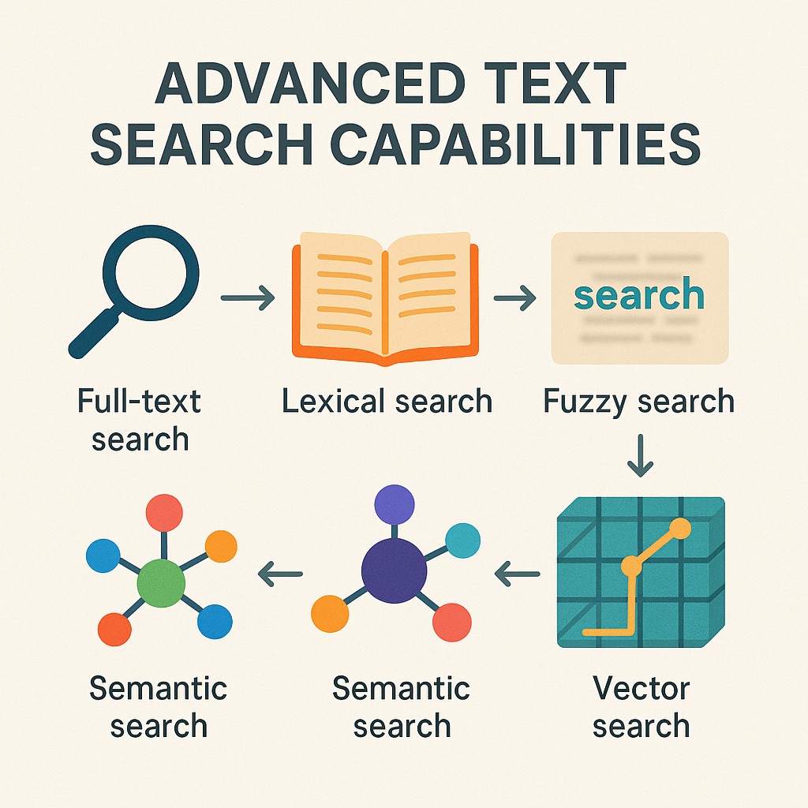
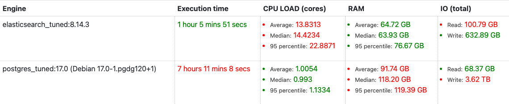
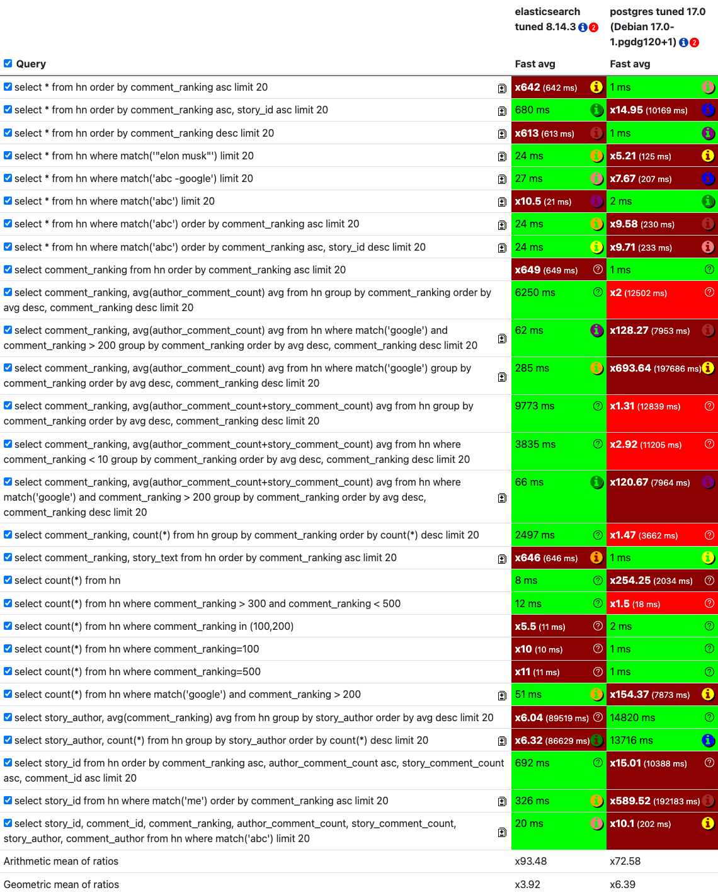
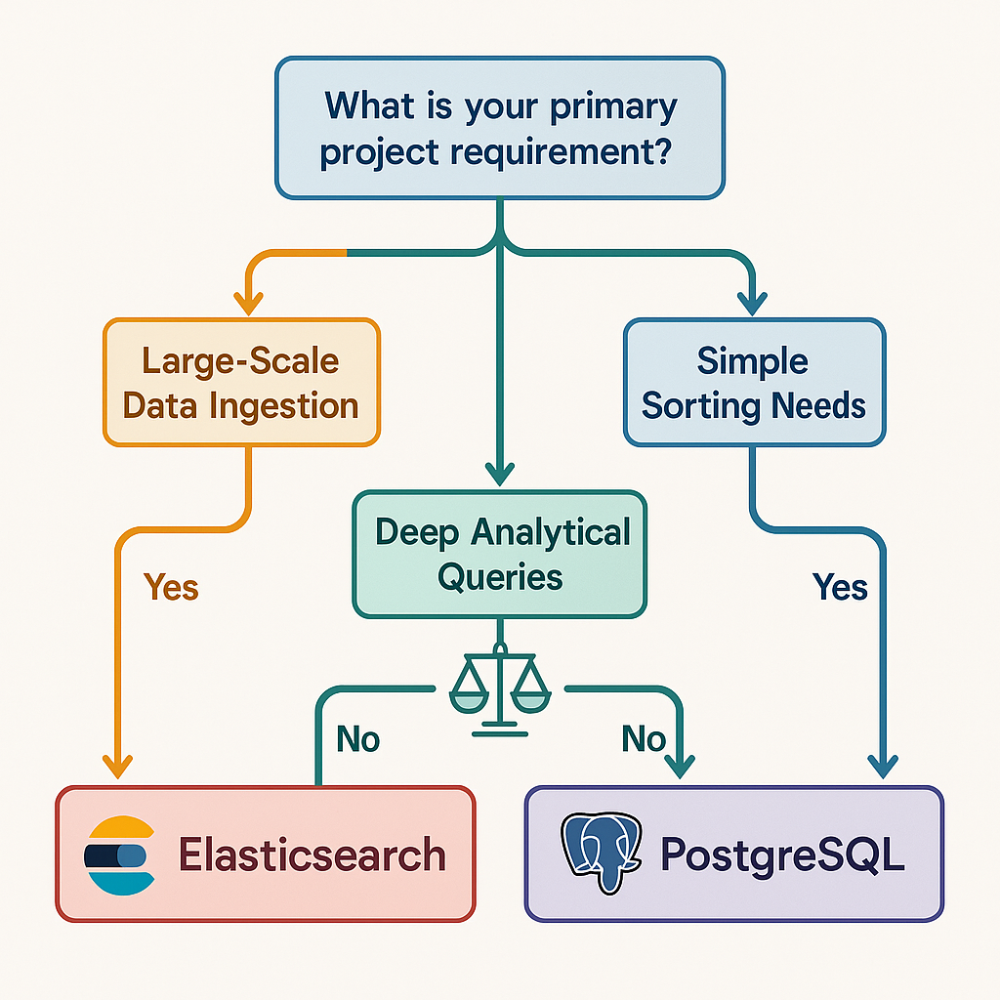

## Text Searching Databases: Beyond Simple Keyword Matches

When you need to sort through tons of text, just looking for keywords often doesn't quite cut it. That's where text searching databases come in. Think of them as super-powered librarians for your data, capable of organizing and finding information with incredible speed and accuracy. These databases, like **Elasticsearch** and **PostgreSQL** (when you add the right tools), are built to handle the nitty-gritty of natural language. They do more than just basic keyword matching; they offer all sorts of cool search options:

*   **Full-text search:** Finding documents that have specific words or phrases.
*   **Lexical search:** Matching exact words and their variations.
*   **Fuzzy search:** Being forgiving about typos and misspellings.
*   **Semantic search:** Getting the gist of what you're looking for to find similar ideas, even if the words are different.
*   **Vector search:** Finding things based on their mathematical representations (think AI stuff!), which is super important for AI-powered apps.

These features make them incredibly useful for things like search engines, analyzing logs, suggesting related items, and basically any system where quickly finding the right text data is a big deal. They can also do cool things like **grouping** similar items, **sorting** results by different things, **geo-searching** based on location, and **filtering** data to show only what you want.

## Benchmarking Databases: Getting Under the Hood

Just like with vector databases, figuring out how these text searching powerhouses perform under pressure is key to picking the right tool for your project. We want to know how fast they can gobble up large amounts of data (how well they perform when uploading) and how quickly they can spit out answers to our questions (how well they perform when querying). This isn't just about being the fastest; it's about finding that sweet spot between performance, cost, and what your project actually needs.

When we benchmark these databases, we're looking at two main things:

1.  **How long does it take to get data into the database and make it searchable?** This is super important for apps that deal with a constant flow of new data or have a huge amount of data to load initially.
2.  **Given a question (query), how quickly can the database find the right information?** This is the heart of any search app – how responsive it is when users ask for something.

It's important to remember that getting super-fast query results can sometimes mean being a bit less precise. The more you let the search be "fuzzy" or flexible, the faster it might be. But for this benchmark, we're focusing on direct performance numbers without getting too deep into fine-tuning the accuracy, as that can make things complicated.

## The Databases: Our Options

In this benchmark, we put two popular options head-to-head: **Elasticsearch** and **PostgreSQL**.

### Elasticsearch

Elasticsearch is a search and analytics tool that works across many computers, built on top of Apache Lucene. It's known for being fast and able to grow with your needs, making it a top choice for analyzing logs, full-text searching, security insights, and operational analytics. It's great at organizing huge amounts of text and finding relevant information super fast. We used Elasticsearch `8.14.3` in this test, which is a recent and well-tuned version.

### PostgreSQL

PostgreSQL is a robust, open-source database system known for being reliable, packed with features, and performing well. While it's traditionally a relational database, with add-ons like `pg_trgm` and built-in full-text search capabilities, it can also handle demanding text search jobs. For this benchmark, we used PostgreSQL `17.0`, a very new version running on Debian.

## The Experiment: Putting Them to the Test

Our experiment used a dataset of 1.1 million Hacker News comments. To really challenge the databases, we multiplied this dataset by 100, giving us **over 100 million documents**. Each document had a mix of text and number fields.

The test server was a powerhouse: an **AMD Ryzen 9 5950X with 16 Cores and 32 Threads**, with about **128 GB of RAM**. We gave **Elasticsearch a hefty 110 GB of RAM** and assumed PostgreSQL had a similarly optimized amount.

We wanted to measure how fast they could handle uploading data and how quickly they could respond to queries. For query performance, we didn't run queries in big batches. Instead, we ran specific queries multiple times to get a reliable average response time. This helps us see how quickly each database handles individual requests when things are consistently busy.

## Test Results: Who Comes Out on Top?

Let's dig into the numbers. The benchmark included a set of full-text and analytical queries designed to test different aspects of each database's abilities.

### Upload Performance

Getting over 100 million documents into a database is a big job. Here's how our options compared:

**Elasticsearch `8.14.3`** managed to get all the data in within **1 hour, 5 minutes, and 51 seconds**. While it was doing this, it used about 13.8 CPU cores on average and around **64.72 GB of RAM**.

**PostgreSQL `17.0`**, on the other hand, took a lot longer – **7 hours, 11 minutes, and 8 seconds** to do the same. It used less CPU on average (1.0054 cores) but slurped up more RAM, around **91.74 GB**.

As you can see from the table, Elasticsearch was significantly faster at getting this massive amount of data loaded. This is often a key difference-maker for systems that handle lots of incoming data.

### Query Performance

This is where things get really interesting. We tested a bunch of different queries, from simple sorting to complex calculations and matching text.

Here's a breakdown of what we saw:

*   **Sorting and Simple Retrieval:** For queries that just involved ordering by `comment_ranking`, PostgreSQL was incredibly fast, often giving results in just **1 ms**. Elasticsearch, while still quick, took hundreds of milliseconds. This is probably because PostgreSQL's relational setup is highly optimized for directly sorting columns.
*   **Full-Text Matching:** When it came to basic `match` queries (like finding comments with 'abc'), both databases did well, though Elasticsearch was a tad faster. However, when we combined `match` with sorting and filtering (like `match('abc') order by comment_ranking asc`), the performance became much more similar, with both taking around **230 ms**.
*   **Aggregations (Grouping and Averaging):** This is where Elasticsearch really shines. For queries that involved grouping by `comment_ranking` and calculating averages, Elasticsearch consistently beat PostgreSQL by **a huge margin**. For example, averaging author comment counts per ranking took Elasticsearch **649 ms** compared to PostgreSQL's **12,502 ms** (that’s over 12 seconds!). Similarly, grouping by `story_author` and counting took Elasticsearch **86 seconds**, while PostgreSQL took almost **13 minutes**.
*   **Filtering with Ranges and Matching:** Queries that combined filtering on number ranges (`comment_ranking > 300 and comment_ranking < 500`) with a `match` query showed more comparable results, with both databases handling them in the 7-8 second range. However, just filtering by a range alone was much faster on Elasticsearch (**51 ms**) compared to PostgreSQL (**7964 ms**).
*   **Simple Counts:** For straightforward `COUNT(*)` operations, PostgreSQL was slower than Elasticsearch, taking **203 ms** versus Elasticsearch's **8 ms**. But, when filtering counts by specific values (`comment_ranking=100`), PostgreSQL was lightning fast again (**1 ms**).

**Queries That Weren't Supported:** It's worth mentioning that PostgreSQL, in its standard setup, might need extra add-ons or configurations for some advanced full-text search features that Elasticsearch offers right out of the box. For instance, complex language analysis or deep understanding of meaning might be more readily available in Elasticsearch.

## Conclusion: Choosing Your Text Search Champion

Our benchmark tests comparing Elasticsearch `8.14.3` and PostgreSQL `17.0` on a massive Hacker News comments dataset reveal distinct strengths for each.

**Elasticsearch** showed better performance in **getting data loaded** and, importantly, in **complex analytical queries** that involve calculations and sorting on large datasets. If your project deals with lots of incoming data, needs fast calculations, or involves intricate text analysis with sorting, Elasticsearch looks like the more powerful choice.

**PostgreSQL**, while much slower at loading data and complex analytics, proved incredibly **fast for simple sorting and exact filtering** on structured data. If your main need is quickly getting records that are precisely ordered or fast counts on well-organized data, and text search is a secondary, less demanding task, PostgreSQL can still be a solid option, especially if you're already using it.

Ultimately, the "best" database totally depends on what you need it for. Think about how much data you have, how complicated your queries are, how fast you need answers in real-time, and what your current tech setup is. While Elasticsearch generally leads in raw text search and analytical performance for big datasets, PostgreSQL remains a flexible powerhouse that can handle many text-based tasks really well, especially when simple ordering and filtering are the most important things.

Would you like to find out more about exciting topics from the world of adesso? Then take a look at our previous blog posts.

Why not check out some of our other interesting blog posts?