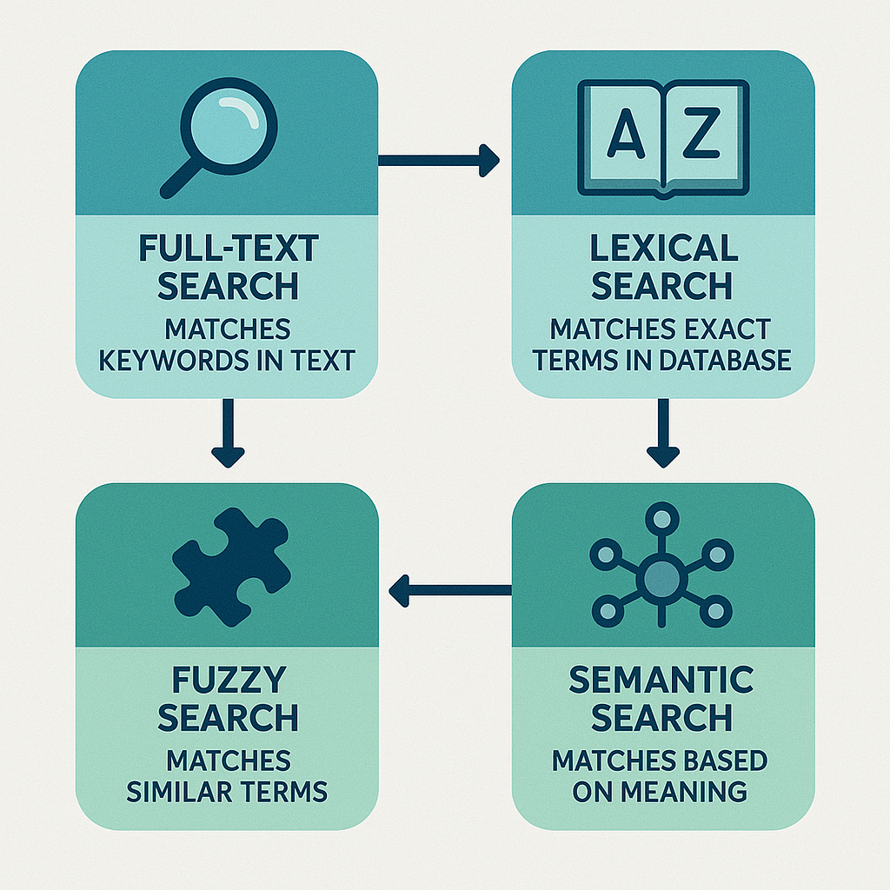
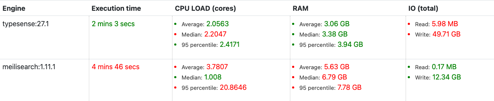
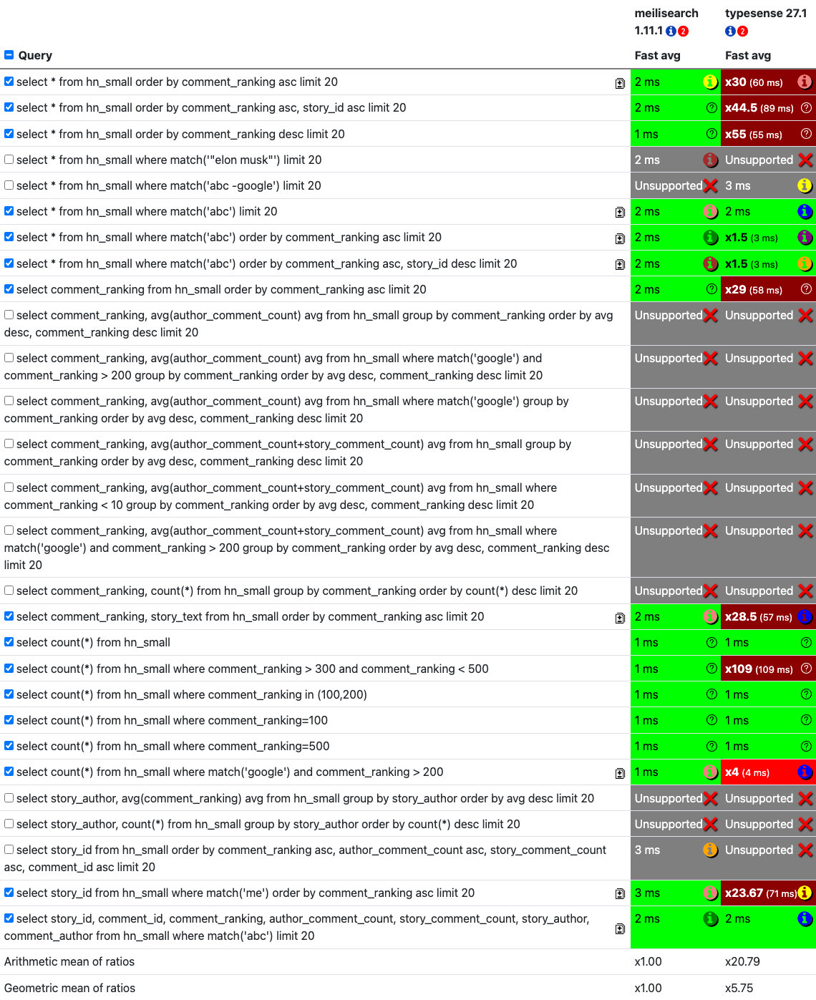
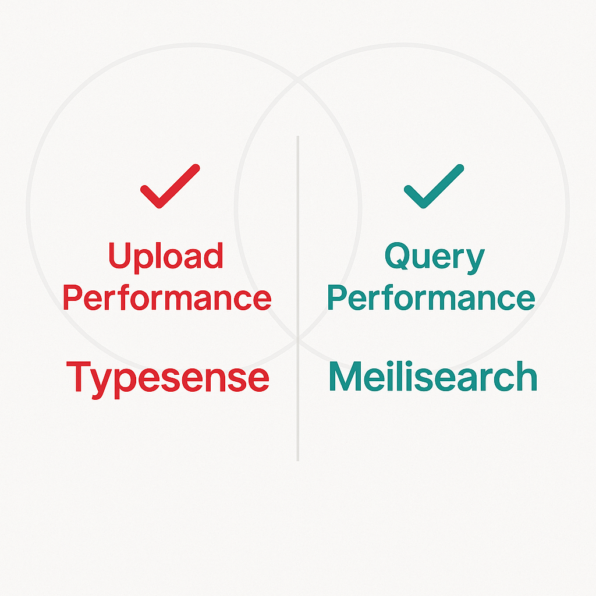

This benchmark test compares how well meilisearch version 1.11.1 and typesense version 27.1 handle the Hacker News comments dataset. This dataset has about 1.1 million comments, all with numbers in them, and you can grab it from https://zenodo.org/record/45901/. We threw in some full-text searches and some analytical queries to see what they could do. For the test setup, we used a pretty powerful machine: an AMD Ryzen 9 5950X processor with 16 cores and 32 threads, and each database got a whopping 110 GB of RAM to play with (out of about 125.7 GB available).

<!--more-->

When we look at the "Fast avg" score, meilisearch:1.11.1 ended up being about **5.75 times faster** overall than typesense:27.1. This is mostly because meilisearch was way quicker on most of the queries we ran, often finishing in just 1-3 milliseconds. Typesense, on the other hand, was considerably slower, taking anywhere from 55 ms to 89 ms for similar tasks. Plus, typesense couldn't handle a few queries that meilisearch managed just fine.

### Text Searching Databases

Full-text search databases are your best friends when you need to dig through heaps of text and find exactly what you're looking for, super fast. Think about how search engines work on the internet or how you might sift through massive log files – these databases are the brains behind that operation. They're built to index huge amounts of text so you can do speedy searches. You can perform all sorts of searches with them, like:

*   **Full-text search:** This is all about finding documents that have specific words or phrases.
*   **Lexical search:** Basically, it's your standard keyword matching.
*   **Fuzzy search:** This is handy because it can find things even if there are a few typos or misspellings.
*   **Semantic search:** This is getting smarter and tries to understand the meaning behind your search terms, not just the exact words.
*   **Vector search:** This is where things get really cool, especially with AI. It means representing text (or other data) as numbers (vectors) and then finding items that are similar in meaning.

These features are super important for building applications like slick search engines, recommendation systems, and powerful tools for analyzing logs. They can also do more complex things like grouping data, sorting results in different ways, searching by location (geo-search), and filtering data based on what you need.

### Benchmarking Databases

When you're trying to pick the best database for your project, it's really important to see how they hold up when put to the test. For databases that do full-text search, we usually focus on two main things:

1.  **How fast can they gobble up new data?** This is all about **upload performance**, or how quickly they can take in and index new information. If you're dealing with a constant flow of data, this is a big deal.
2.  **How fast can they find stuff when you ask for it?** This is **query performance**, which measures how quickly the database can give you back results for your searches. This is super important for anything that needs to give quick answers.

It's also worth remembering that when we talk about how fast queries run, we're often dealing with **approximations**. The easier a database makes it to search, the faster it can be, but it might not be perfectly accurate. For our tests, we kept it simple by focusing on speed and broad functionality, without getting bogged down in tweaking every single setting to get the absolute best accuracy, because that can get super complicated really fast.

### The Databases

In our little experiment, we put two popular competitors head-to-head: **meilisearch** and **typesense**.

**meilisearch**  
Meilisearch is an open-source search engine that's all about being fast and easy to use. It's built to be incredibly quick for both adding new data (indexing) and searching, making it a great choice for apps where real-time search is a must. It's known for being straightforward to set up and for delivering results with super low delay.

**typesense**  
Typesense is another open-source search engine that aims to provide a fast search experience that can also handle typos like a champ. It wants to be a "type-safe" alternative to other search engines, meaning it's designed to be really reliable and easy to integrate into your projects. Typesense also boasts quick indexing and search speeds, with a big focus on giving you relevant results even when your search queries aren't perfect.

### The Experiment

For this benchmark, we decided to really push meilisearch (v1.11.1) and typesense (v27.1) to their limits using the **Hacker News comments dataset**. This dataset is pretty substantial, with about **1.1 million comments**, each having various numeric fields. We wanted to see how they handled both typical full-text searches and some analytical queries.

Our testing setup was pretty beefy: a server with a **32-thread AMD Ryzen 9 5950X CPU** and a generous **110 GB of RAM** allocated to each database. We didn't use batch processing here; instead, we ran each query multiple times to get a solid measure of how fast they responded to individual requests. This way, we could really see how quickly each engine reacted to single searches.

### Test Results

#### Upload Performance

When it comes to getting data into the databases, things look a bit different. **typesense:27.1** absolutely nailed it here, finishing the data ingestion in just **2 minutes and 3 seconds**. It also used computer power better during this phase, with lower average CPU use and less RAM needed. However, it did write a massive **49.71 GB** of data to disk.

**meilisearch:1.11.1**, on the other hand, took quite a bit longer to ingest the same data, coming in at **4 minutes and 46 seconds**. It used more CPU and RAM on average but wrote much less data to the disk (**12.34 GB**).

#### Query Performance

Now, for the actual searching of the data, **meilisearch:1.11.1** consistently did the best. It's incredibly fast, often returning results in just **1 to 3 milliseconds** for most queries. This makes it a great choice when every moment matters.

**typesense:27.1** was much slower for many of these queries, with execution times ranging from **55 ms to 89 ms** for simple sorting and retrieval tasks. While it did handle some basic full-text searches quickly, how searches worked overall was much worse than meilisearch in this test.

What's also cool is what *couldn't* be done. A bunch of queries were marked as "Unsupported" for both engines, especially those involving fancy grouping (like `GROUP BY` with `AVG` or `COUNT(*)`) and sorting by many columns with specific rules. This shows that while both are capable search engines, they have different strengths and weaknesses when it comes to advanced querying.

Here's a breakdown of how they performed on the different query types:

*   **Simple Ordering and Limit:** For basic sorting and fetching a limited number of results (like `ORDER BY comment_ranking asc limit 20`), meilisearch was lightning fast (1-2 ms), while typesense was much slower (55-89 ms).
*   **Basic Full-Text Search:** Both engines handled simple `match('abc')` queries quickly (around 2-3 ms). However, typesense managed a query with negation (`match('abc -google')`) that meilisearch did not support.
*   **Filtering and Full-Text:** Combining filters like `match('google') and comment_ranking > 200` was super fast for meilisearch (1 ms) and still quick for typesense (4 ms).
*   **Count Queries:** Simple `COUNT(*)` was instantaneous for both. However, `COUNT(*)` with range filters (`comment_ranking > 300 and comment_ranking < 500`) was much faster on meilisearch (1 ms) compared to typesense (109 ms).
*   **Complex Aggregations and Multi-Column Sorting:** This is where we saw the most "Unsupported" results. Both meilisearch and typesense failed to execute queries involving `GROUP BY` with aggregate functions (`avg`, `count`) combined with ordering, or queries with multiple `ORDER BY` clauses alongside specific filtering and aggregation. This suggests that for complex analytical tasks beyond simple text matching and basic sorting, neither engine might be a direct replacement for a dedicated analytical database.

### Conclusion

Our benchmark tests show that when it comes to **query performance**, **meilisearch:1.11.1 is the obvious winner**. It consistently delivered results at lightning-fast speeds, often in just a few milliseconds, and handled more types of queries than typesense in this test.

However, **typesense:27.1** had a big advantage in **data ingestion speed**, finishing the upload process much faster and using less power during that time. It also managed to run one specific query (with negation) that meilisearch couldn't handle.

The many "Unsupported" results for advanced queries highlight that neither database is perfect for every tricky data task. If your main goal is blazing-fast search and being able to run lots of different queries, meilisearch looks like a strong pick. If getting your data loaded as fast as possible is your top priority and your querying needs are simpler, typesense could be a good choice. In the end, the best one really depends on what you need and what data you're using!