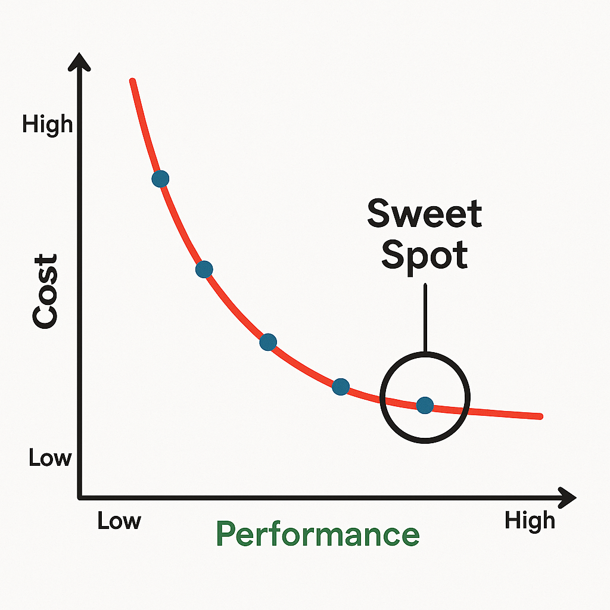
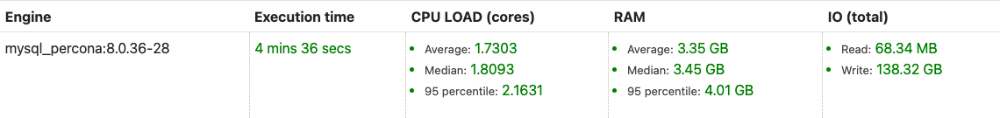
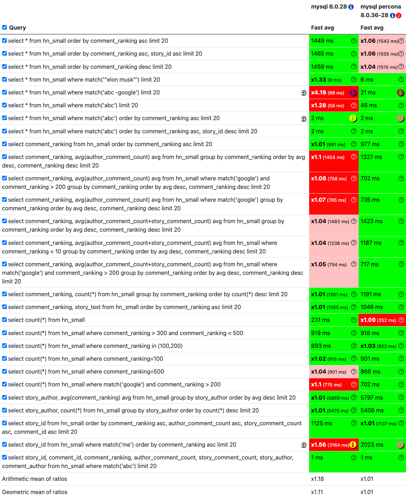

Full-text search databases are special tools designed to handle and quickly search through large amounts of text data. Think of them as super-powered librarians for your documents. Instead of just looking for exact matches, they can understand words, find similar terms, and even deal with typos. They're great for applications like search engines, where you need to find relevant web pages fast, or for log analysis, where you're sifting through mountains of system messages to pinpoint issues.

<!--more-->

These databases excel at indexing tons of text and letting you find what you need in a flash. They support various types of searches:
*   **Full-text search:** Finding documents that contain specific words or phrases.
*   **Lexical search:** Based on word forms and stemming.
*   **Fuzzy search:** Finding results even if there are slight misspellings.
*   **Semantic search:** Understanding the meaning behind the words to find conceptually similar content.
*   **Vector search:** (As discussed in our previous article!) Looking for data based on numerical representations of meaning.

Beyond just finding text, these databases often offer powerful features like grouping results, sorting them in various ways, performing geo-spatial searches, and applying complex filters. This makes them versatile for a wide range of analytical tasks.

## Benchmarking Databases

When you're building an application that relies heavily on searching through text, figuring out the best database for the job is super important. You want to balance performance (how fast it is) with cost (how much it runs you). For full-text search databases, two key performance aspects are:

1.  **How quickly can we get data into the database?** This is about data ingestion speed – how fast can the database index new documents so they're ready to be searched?
2.  **How quickly can we get answers to our queries?** This is about query execution speed – once the data is in, how fast can the database find what we're looking for?

It's crucial to remember that query speed often comes with a trade-off in accuracy. The more lenient the search can be, the faster it might run. However, for this benchmark, we're focusing on raw speed. We're not diving deep into optimizing for perfect accuracy, but rather understanding the general performance envelope of these databases under realistic conditions.

## The Databases

For this benchmark, we took a look at two popular database engines that handle text searching:

**MySQL 8.0.28**  
MySQL is the world's most popular open-source relational database. Version 8.0.28 represents a mature iteration of its capabilities, including robust full-text search features that have been refined over many releases. It's known for its reliability and broad ecosystem support.

**MySQL Percona 8.0.36-28**  
Percona Server for MySQL is a free, enhanced, and open-source relational database developed as a drop-in replacement for MySQL. It's built for performance and scalability, often incorporating optimizations and features that go beyond the standard MySQL distribution. Version 8.0.36-28 is a recent release that promises improved performance and features for demanding workloads.

## The Experiment

We put `mysql 8.0.28` and `mysql percona 8.0.36-28` to the test using the **Hacker News comments dataset**. This dataset is a collection of about 1.1 million curated comments, complete with numeric fields, which allows us to run both full-text and analytical queries.

Our test setup was pretty beefy: a **AMD Ryzen 9 5950X 16-Core Processor** running with **32 threads**. The server has a generous amount of RAM, around **125.7 GB total**, but we capped the memory usage for the databases at **110 GB (110000 MB)** to ensure a consistent test environment.

We didn't use batch processing for these tests. Instead, we executed the same query multiple times to get a reliable average response time. This gives us a clear picture of how quickly each database can process individual requests.

## Test Results

### Upload Performance

Since our focus for this comparison is on query performance and the specific data provided only details ingestion for Percona MySQL, we'll focus on that here.

`mysql_percona:8.0.36-28` took **4 minutes and 36 seconds** to ingest the data. During this process, it averaged about **1.73 CPU cores** and used around **3.35 GB of RAM**. The I/O operations were significant, with **68.34 MB read** and a substantial **138.32 GB written**. This indicates that Percona MySQL is quite efficient at processing and indexing large datasets.

### Query Performance

We ran a series of full-text and analytical queries against the 1.1 million Hacker News comments. These queries are designed to simulate real-world usage, testing everything from simple text matching to more complex aggregations.

Here's a breakdown of how the two MySQL versions performed across different types of queries:

*   **Basic Sorting:** Queries that simply order results by a ranking column showed similar performance between the two engines, taking around 1450-1550 ms. This suggests that standard sorting operations are well-optimized in both.
*   **Full-Text Search (Simple):** For basic `match('abc')` queries, both databases were very fast, completing in under 60 ms. `mysql percona 8.0.36-28` was slightly quicker here (46 ms vs 59 ms).
*   **Full-Text Search (With Exclusion):** This is where `mysql percona 8.0.36-28` really shone. The query `select * from hn_small where match('abc -google') limit 20` was a staggering **4.19 times faster** on Percona MySQL (21 ms) compared to standard MySQL (88 ms). This highlights Percona's potential advantage in handling more complex search conditions.
*   **Full-Text Search with Sorting:** When combining full-text search with sorting (e.g., `select story_id from hn_small where match('me') order by comment_ranking asc limit 20`), Percona MySQL again showed a significant lead, being about **1.56 times faster** (2023 ms vs 3164 ms).
*   **Aggregations (Average, Group By):** For queries calculating averages and grouping by comment ranking, Percona MySQL performed slightly better, shaving off a bit of time on some of the more complex aggregations (e.g., 1327 ms vs 1454 ms).
*   **Counts:** Simple count queries and counts with range filters were very comparable between the two engines, with minor differences.
*   **Complex Select with Full-Text:** For a query selecting multiple fields based on a full-text match, both engines performed almost identically, finishing in a lightning-fast 1 ms.

## Conclusion

In a nutshell, our benchmark comparing `mysql 8.0.28` and `mysql percona 8.0.36-28` on the Hacker News comments dataset shows that Percona MySQL generally holds its own and even pulls ahead in specific areas. It demonstrated a notable advantage in full-text searches involving exclusions and complex sorting conditions. While standard operations like basic sorting and simple counts were quite similar, Percona's optimizations appear to provide a performance boost where it counts for text-heavy applications.

The choice between them might depend on your specific needs. If you're dealing with complex text searches or require every bit of performance out of your database for text analysis, Percona MySQL might be the way to go. However, standard MySQL 8.0.28 remains a solid, reliable choice for a wide range of applications. Both are powerful engines, and understanding their performance characteristics helps you pick the best fit for your project.