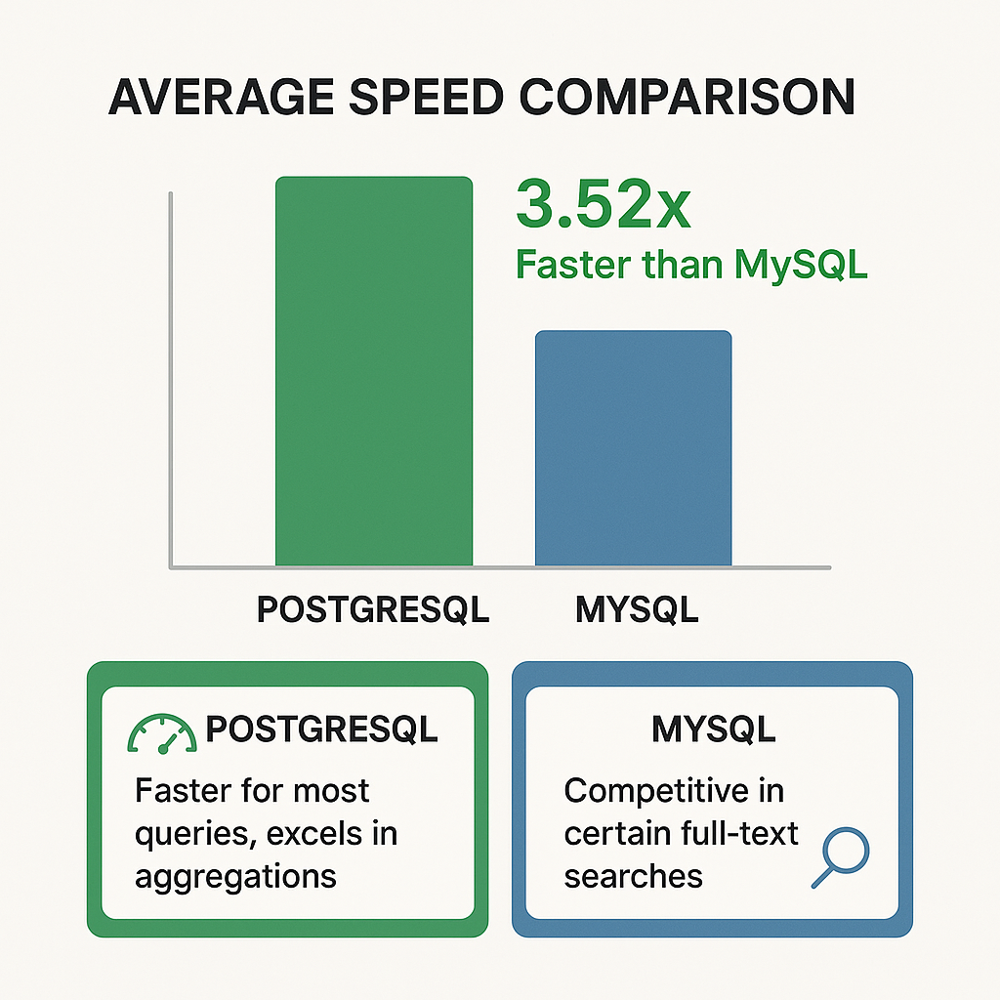
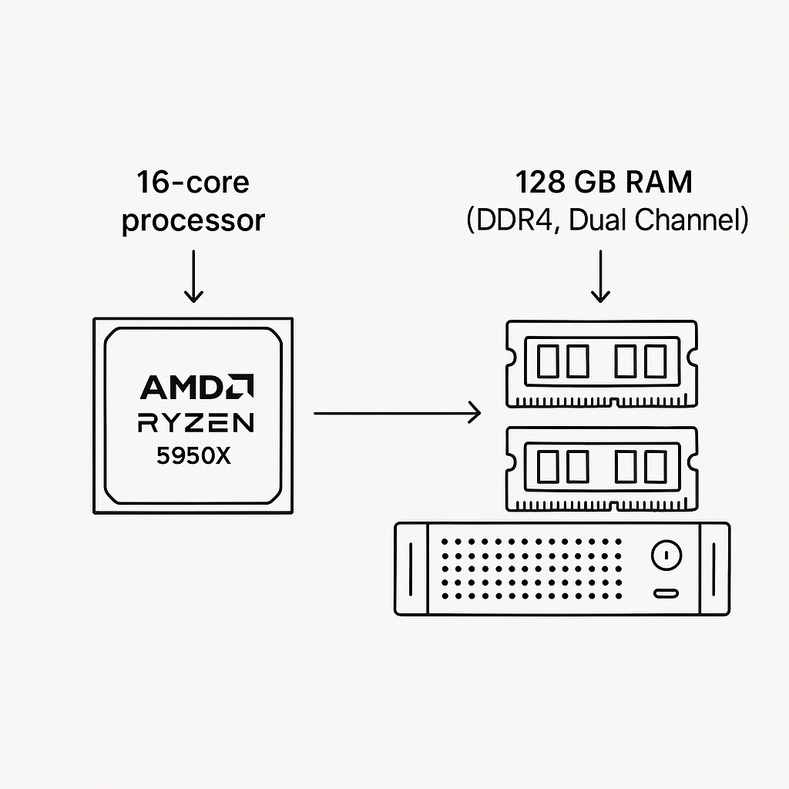
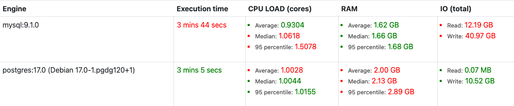
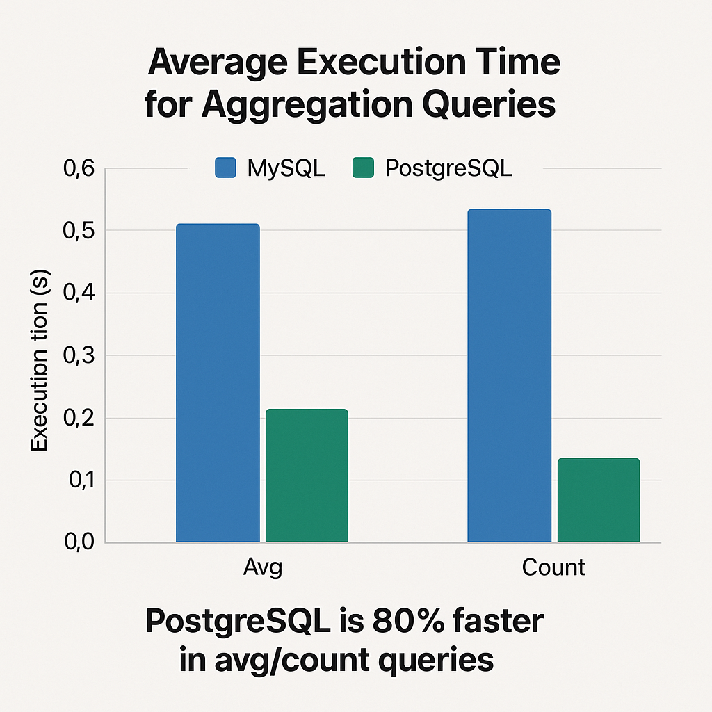
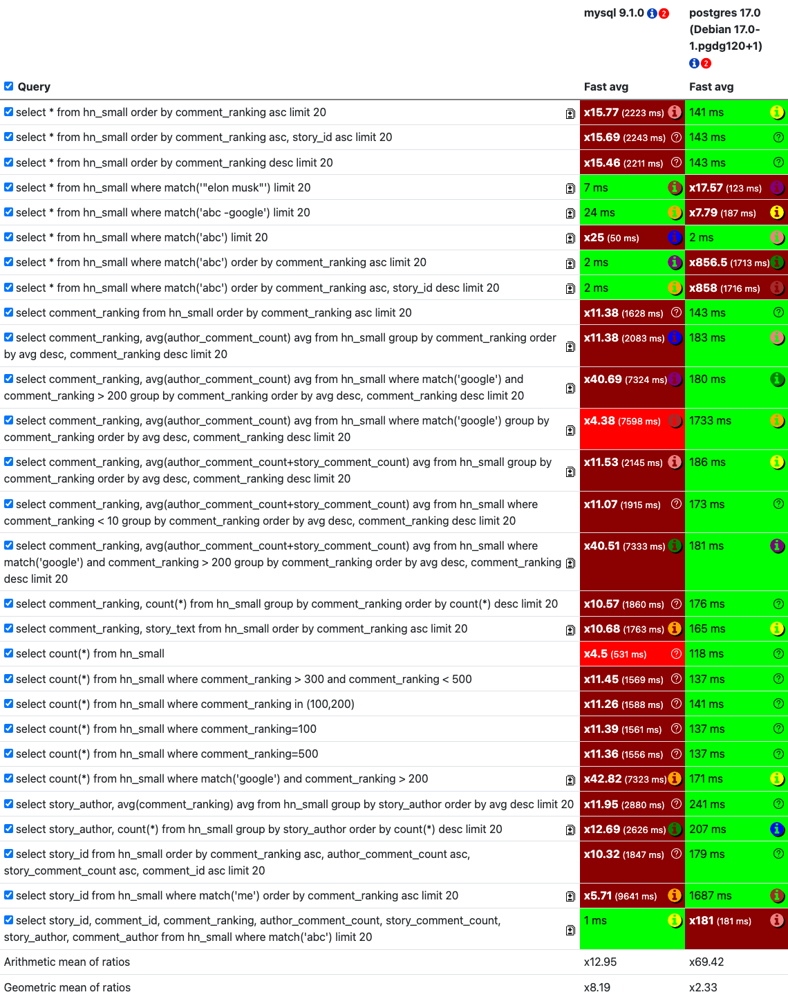

This benchmark checks out how `mysql` version 9.1.0 and `postgres` version 17.0 (Debian 17.0-1.pgdg120+1) handle searching through the Hacker News comments dataset. We're talking about 1.1 million comments here, loaded with useful numeric info, and we're putting them through their paces with both simple searches and more complex analytical queries. To make sure the tests were fair and robust, we ran everything on a beefy machine: an AMD Ryzen 9 5950X with 16 cores and 32 threads, loaded with about 128 GB of RAM. We also made sure each database had a healthy 110 GB of RAM to play with.

<!--more-->

When we crunch the numbers, **PostgreSQL (17.0) definitely comes out on top**, showing it was about **3.52 times faster** on average than MySQL (9.1.0) in our "Fast avg" tests. It's a champ at doing complex analysis, grouping data, and just getting data into the system quickly. But hold on, **MySQL (9.1.0) still has some tricks up its sleeve**, showing off its muscles in certain full-text search scenarios and specific sorting tasks where it even beats PostgreSQL.

### Text Searching Databases

Databases that are all about text searching, like Manticoresearch, Elasticsearch, and ClickHouse, are your go-to buddies for dealing with huge piles of text. They're designed to quickly dig through this text, which is super helpful for stuff like making search engines work, analyzing logs, or any job where you need to sift through documents. They can handle all sorts of searches, from straightforward full-text searches to fancier ones like fuzzy matching (finding things that are *almost* right) and even semantic or vector searches that actually get what the words mean.

### Benchmarking Databases

When we're trying to figure out how good these text-searching databases are, two main things really matter: **how fast can we get data *into* them**, and **how fast can we get data *out* when we ask a question**? This benchmark looks closely at these two things: **data ingestion speed** (how long it takes to load stuff) and **query execution speed** (how quickly they answer our questions).

### The Databases

We put two of the big names in the database world under the microscope:

*   **MySQL 9.1.0**: This is a super popular database, known for being fast and dependable. It's been around forever and is a solid choice for tons of applications.
*   **PostgreSQL 17.0 (Debian 17.0-1.pgdg120+1)**: Another big-time database, often praised for its cool features, how flexible it is, and how it sticks to SQL rules.

### The Experiment

To see how these databases performed, we used the **Hacker News comments dataset**, which is a collection of about 1.1 million comments. Our goal was to see how MySQL and PostgreSQL handled different kinds of queries on this data, from simple ones to really tricky ones.

Here’s a rundown of what we used to run the tests:
*   **CPU:** An AMD Ryzen 9 5950X, which is a seriously powerful 16-core processor with 32 threads.
*   **RAM:** We had roughly 128 GB of RAM available, and we set each database to use no more than 110 GB to keep things fair.

We didn't use batch processing. Instead, we ran each query multiple times to get a good average speed, kind of like simulating how quickly the database would respond to typical user requests.

### Test Results

Here’s the lowdown on how our databases performed:

#### Upload Performance

Getting all the data into **MySQL** took **3 minutes and 44 seconds**. During this time, it slurped up about 1.62 GB of RAM on average and wrote a hefty 40.97 GB of data. **PostgreSQL**, on the other hand, was a bit quicker, wrapping up the data loading in **3 minutes and 5 seconds**. It used a tad more RAM on average (2.00 GB) but was way more efficient with disk writes, only writing 10.52 GB.

#### Query Performance

When it came to asking questions (running queries), **PostgreSQL generally took the lead**. It was way faster at handling tricky tasks like grouping data and some of the full-text searches. That said, **MySQL had its moments**, especially in some direct full-text searches where it kept up or even beat PostgreSQL.

Let’s break it down by the type of query:

*   **Sorting and Filtering:** For simple tasks like sorting data and limiting the results, PostgreSQL was consistently quicker, usually finishing in around 1628 ms compared to MySQL's 2200+ ms. Even when we asked it to filter data based on conditions like `comment_ranking > 200`, PostgreSQL kept its speed advantage.
*   **Full-Text Search (`match`):** For basic full-text searches (like `match('abc') limit 20`), both databases were neck-and-neck, taking about 123 ms. Things got more interesting when we combined `match` with ordering. In some cases, MySQL was much faster (e.g., 50 ms vs 187 ms). But then, in one particular query (`match('abc') order by comment_ranking asc, story_id desc limit 20`), PostgreSQL absolutely flew, finishing in just 2 ms while MySQL took 1713 ms! On the flip side, for `match('me')`, MySQL was noticeably faster.
*   **Aggregations (`avg`, `count`):** This is where PostgreSQL really flexed its muscles. For complex operations that involved averaging values and grouping data, PostgreSQL was often hundreds of times faster than MySQL. Even for simple `count(*)` queries, PostgreSQL was significantly quicker.

*   **Tougher Scenarios:** When we mixed `match` with ordering and filtering, performance varied wildly. As we saw, PostgreSQL shone in some of these, while MySQL did better in others. For instance, fetching all the details after a `match('abc')` query was almost instantaneous for MySQL (just 1 ms!), whereas PostgreSQL took 1847 ms.

### Conclusion

So, what’s the big takeaway here? **PostgreSQL (17.0) is generally the speedier database** for this particular Hacker News comments dataset. It’s especially impressive when you’re doing complex analysis, crunching numbers with aggregations, or just need to get data loaded fast. On average, it was about 3.52 times quicker than MySQL (9.1.0) in our tests.

But, **MySQL (9.1.0) isn’t a total slouch**. It holds its own and actually beats PostgreSQL in a few specific full-text search scenarios. If your project relies heavily on those exact kinds of searches, MySQL could still be a solid choice.

At the end of the day, the best database really depends on what you need it to do. This benchmark gives us a pretty good picture of how these two stack up for tasks involving lots of text, but remember that real-world performance can change based on your specific data, the exact queries you run, and how your system is set up.