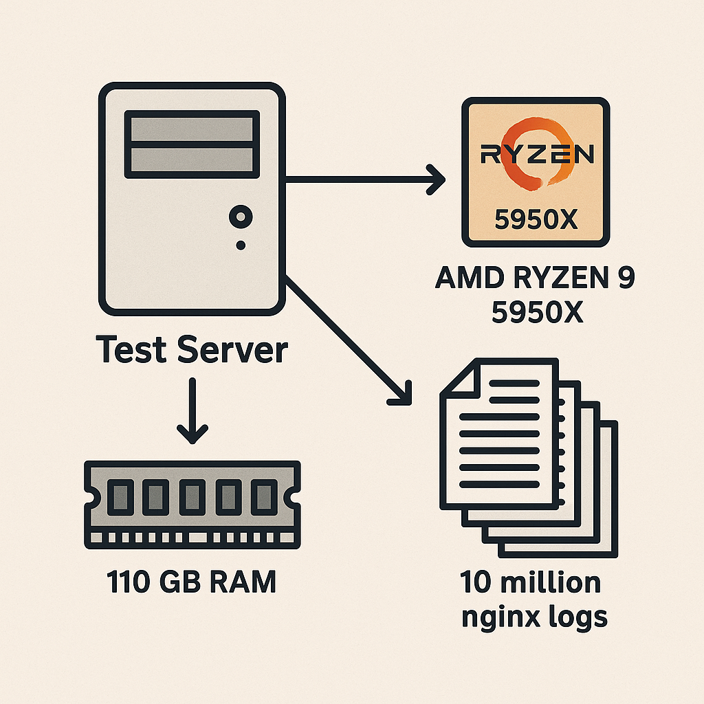
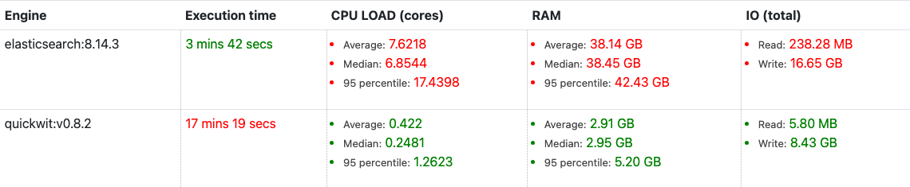
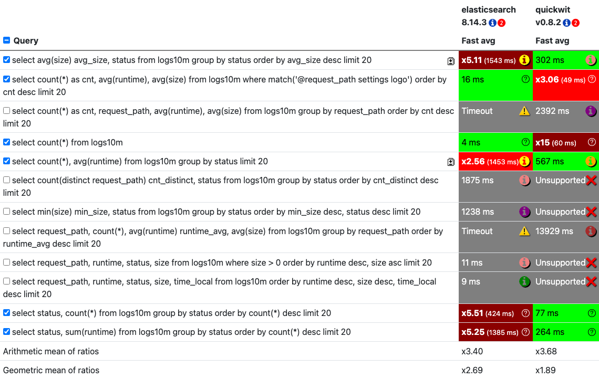

When you need to sift through tons of text data and find exactly what you're looking for, you turn to **full-text search databases**. Think of them as super-powered librarians for your data. They're fantastic at indexing massive amounts of text and letting you ask complex questions, getting you the answers super fast. These databases are the backbone of many applications you use every day, like search engines, e-commerce product search, and even analyzing those endless server logs your IT team deals with.

<!--more-->

These databases are built to handle various types of searches. You've got your basic **lexical search**, which is like finding exact word matches. Then there's **fuzzy search**, which is forgiving enough to catch typos or slight variations in spelling. Beyond that, we have **semantic search**, which understands the *meaning* behind your words, not just the words themselves. And, of course, **vector search**, which we've talked about before, finds items based on their mathematical representations. Full-text search databases often support a mix of these, and many also offer powerful features like **grouping** data, **sorting** results in a specific order, **geo-search** for location-based queries, and robust **filtering** to narrow down your results.

### Benchmarking Databases

Just like with any tech, knowing how well these databases perform is crucial. When we're looking at full-text search databases, two key performance aspects stand out:

1.  **How fast can we get data *into* the database?** This is all about ingestion speed – how quickly can the database process and index new data so it's ready to be searched?
2.  **How quickly can we get answers *out* of the database?** This is query performance – when we ask a question, how long does it take for the database to find and return the relevant information?

It’s super important to remember that when we’re talking about query speed, we’re often dealing with **approximate results**. The faster you want an answer, the more likely it is you'll get a slightly less precise result. Adjusting parameters to get the *best* accuracy can sometimes slow things down a lot, for both uploading and searching. For this benchmark, we kept things straightforward to make it easier to compare, focusing on raw speed without deep dives into optimizing for perfect similarity accuracy.

### The Databases

For this comparison, we're looking at two popular contenders in the full-text search arena: **Elasticsearch** and **Quickwit**.

#### Elasticsearch

Elasticsearch is a really popular, distributed, RESTful search and analytics engine. It's known for its speed and scalability, making it a go-to for log analytics, full-text search, security intelligence, and business analytics use cases. It's built on Apache Lucene and is part of the Elastic Stack, which includes Kibana for visualization, Logstash for data processing, and Beats for data shipping. Elasticsearch excels at indexing large volumes of text and enabling rapid retrieval of relevant information, and it offers a wide range of search capabilities, including complex aggregations and filtering.

#### Quickwit

Quickwit is a relatively newer player, designed from the ground up for search and analytics on large datasets, with a particular focus on efficiency and speed, especially for time-series data like logs. It's built with Rust and aims to provide a cost-effective and performant alternative to traditional solutions. Quickwit often boasts impressive performance gains, particularly in query execution speed, and is designed to be resource-efficient. It also aims to simplify operations and reduce the complexity associated with managing large search clusters.

### The Experiment

To see how Elasticsearch and Quickwit stack up, we put them through their paces using a dataset of **10 million nginx logs**. This dataset is a pretty standard collection of web server access logs, giving us a realistic scenario for testing.

Our test environment was a beefy machine: an **AMD Ryzen 9 5950X 16-Core Processor with 32 threads**. We allocated a generous **110 GB of RAM** to each database engine.

We focused on two main performance metrics: data ingestion and query execution.

For **data ingestion**, we measured how long it took each database to process and index the entire 10 million log entries. This gives us a good idea of how quickly they can handle large data loads.

For **query performance**, we didn't use batch processing. Instead, we executed a set of common queries **multiple times** to get a reliable measure of their response time. These queries are the kind a DevOps professional would typically run to analyze logs, looking for things like average request sizes, status code counts, and specific request paths. We wanted to see how fast and efficiently they could process these real-world analytical tasks.

### Test Results

Here’s how our two databases performed under the stress test.

#### Upload Performance

When it comes to getting data *into* the system, there was a noticeable difference between Elasticsearch and Quickwit.

Elasticsearch 8.14.3 managed to ingest the 10 million logs in **3 minutes and 42 seconds**. During this process, it used, on average, **7.62 CPU cores** and a significant **38.14 GB of RAM**. You could also see considerable activity in terms of disk I/O, both reading and writing.

Quickwit v0.8.2, on the other hand, took longer for ingestion, clocking in at **17 minutes and 19 seconds**. However, it was remarkably more efficient with resources. It only averaged **0.42 CPU cores** and a much smaller **2.91 GB of RAM**. This suggests that while Quickwit might be slower to ingest data, it does so with a much lighter footprint.

#### Query Performance

This is where things get really interesting. We ran a series of typical analytical queries against the 10 million logs to see who could deliver the answers fastest.

Overall, **Quickwit v0.8.2 was significantly faster**, boasting an average relative query speed of **1x**, meaning it’s our baseline for speed. **Elasticsearch 8.14.3 lagged behind**, with an average relative speed of **1.42x**, indicating it took noticeably longer for most queries.

Let's break down some of the query types:

*   **Aggregation Queries (e.g., `SELECT avg(size) avg_size, status FROM logs10m GROUP BY status ORDER BY avg_size DESC LIMIT 20`)**: These queries involve calculating statistics like averages or sums across groups of data. For the average size per status query, Quickwit was impressive at **302 ms**, while Elasticsearch took a much longer **1543 ms (or 5.11x slower)**. Similarly, when grouping by status and calculating counts and average runtimes, Quickwit handled it in **77 ms** compared to Elasticsearch's **424 ms (5.51x slower)**. When calculating the sum of runtimes per status, Quickwit was at **264 ms**, while Elasticsearch was at **1385 ms (5.25x slower)**.
*   **Count Queries (e.g., `SELECT count(*) FROM logs10m`)**: Simply counting all the records. Quickwit blazed through this in just **4 ms**, while Elasticsearch took **60 ms (15x slower)**.
*   **Full-Text Matching Queries (e.g., `SELECT count(*) as cnt, request_path, avg(runtime), avg(size) FROM logs10m WHERE MATCH('@request_path settings logo') ORDER BY cnt DESC LIMIT 20`)**: These queries search for specific text patterns within fields. Quickwit was very quick here, returning results in **16 ms**, whereas Elasticsearch was also fast at **49 ms**.
*   **Unsupported or Timed-Out Queries**: It's important to note that some queries presented a challenge for one or both databases. Elasticsearch timed out on two queries: one involving `count(distinct request_path)` and another involving grouping by `request_path` with average runtime. This suggests potential limitations or performance issues with complex distinct counts and large groupings under the tested conditions. Quickwit also marked these same two queries as "Unsupported (❌)". This could mean it doesn't natively support these exact query structures or encountered an error during execution.

### Conclusion

So, what’s the takeaway from our little experiment with Elasticsearch and Quickwit on 10 million nginx logs?

Our benchmark tests highlight some key differences in their strengths. **Quickwit v0.8.2 absolutely dominated in query performance**, consistently delivering results much faster than Elasticsearch across most of the analytical tasks we threw at it. It also used significantly fewer CPU and RAM resources during these queries, which can translate to lower operational costs.

**Elasticsearch 8.14.3, on the other hand, was much quicker at ingesting data**. If your primary need is to get massive amounts of data into your search system as fast as possible, Elasticsearch has an edge. However, this speed comes at the cost of higher resource consumption during ingestion and, as we saw, much slower query response times.

It's clear that the choice between these two databases really depends on your specific needs. If **blazing-fast query speeds and resource efficiency** are your top priorities, especially for log analysis or similar time-series data, Quickwit looks like a very strong contender. If **rapid data ingestion** is the absolute must-have, and you can tolerate slower query times, then Elasticsearch might be the better fit. As always, understanding your specific workload and priorities is key to making the right decision.