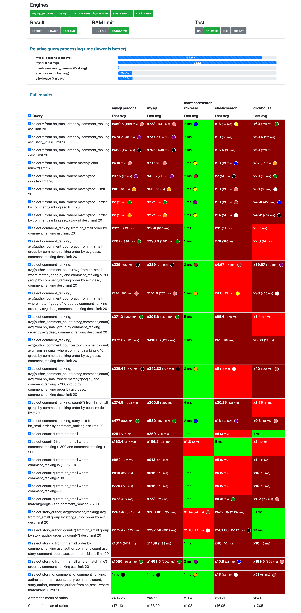
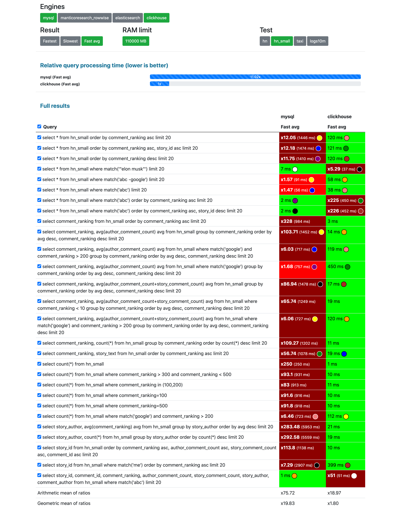
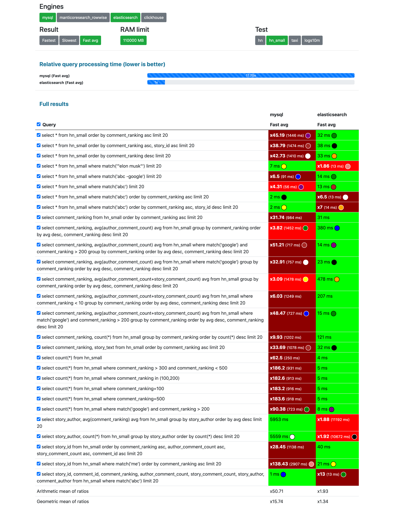
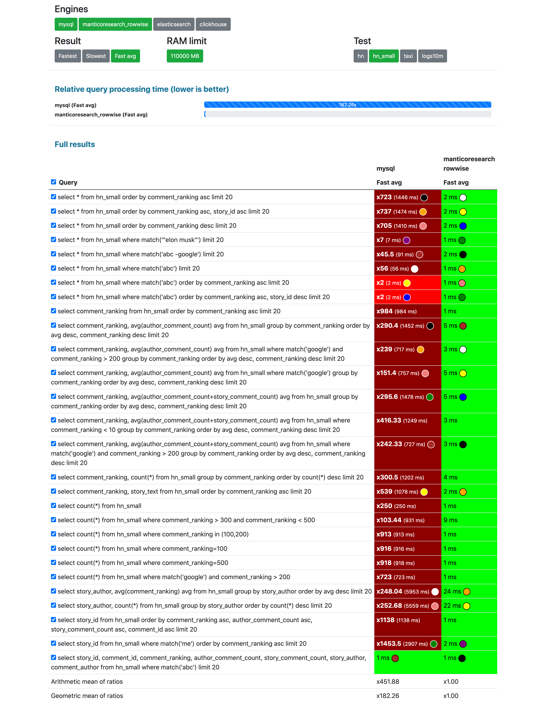
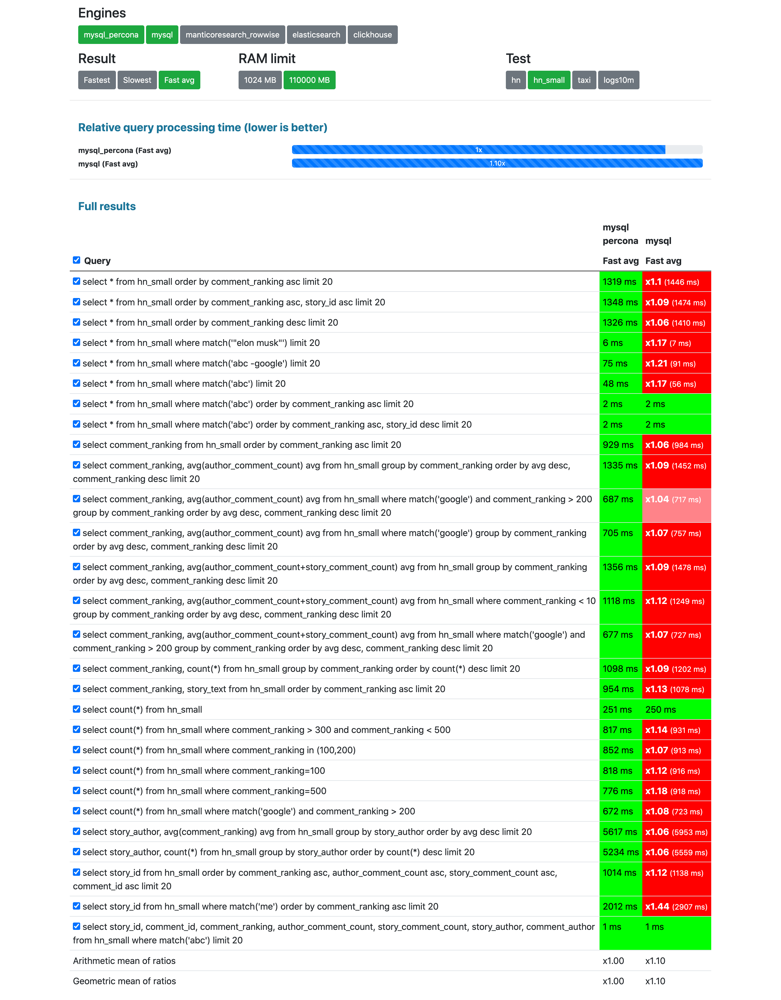
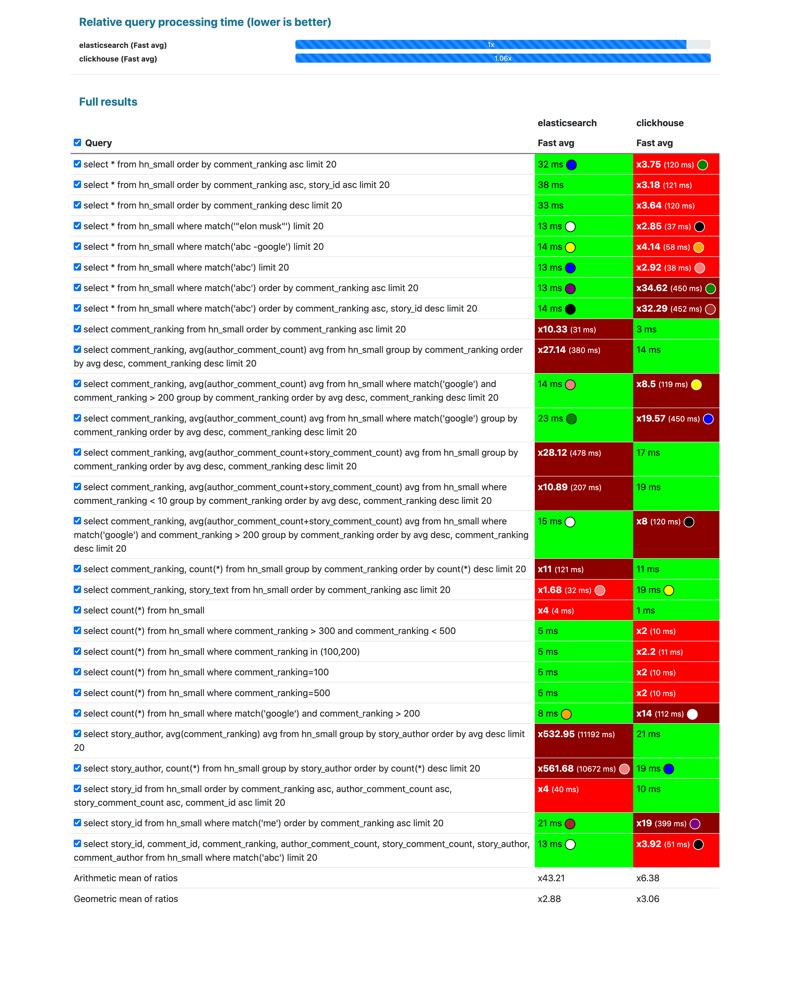
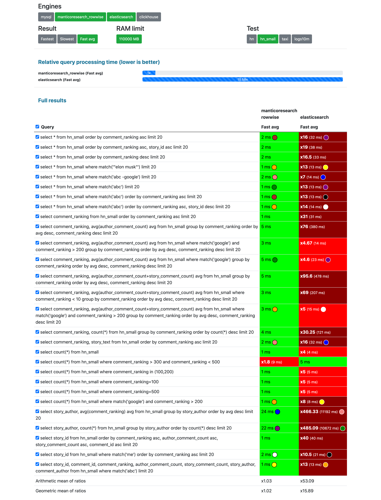
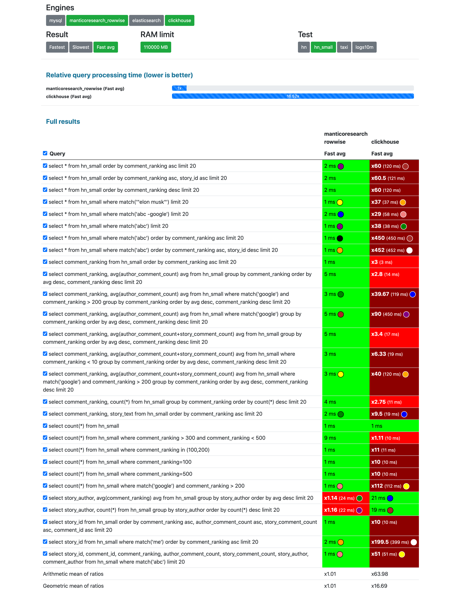

## Intro

In this test we use the data collection of 1.1M [Hacker News](https://news.ycombinator.com/) curated comments with numeric fields from https://zenodo.org/record/45901. In the modern world 1 million of documents can be considered a very small data set which, however, can be typical for many applications: blogs and news sites, online stores, job, automotive and real estate sites and so on. It's typical for such applications to have:
* not very long textual data in one or multiple fields
* and a number of attributes

<!--more-->

## Data collection

The source of the data collection is https://zenodo.org/record/45901.

The record structure is:

```json
"properties": {
   "story_id": {"type": "integer"},
   "story_text": {"type": "text"},
   "story_author": {"type": "text", "fields": {"raw": {"type":"keyword"}}},
   "comment_id": {"type": "integer"},
   "comment_text": {"type": "text"},
   "comment_author": {"type": "text", "fields": {"raw": {"type":"keyword"}}},
   "comment_ranking": {"type": "integer"},
   "author_comment_count": {"type": "integer"},
   "story_comment_count": {"type": "integer"}
}
```

## Databases

So far we have made this test available for 4 databases:

* [MySQL](https://www.mysql.com/) - "world's most popular" open source OLTP database,
* [Percona Server for MySQL](https://www.percona.com/software/mysql-database/percona-server) - free, fully compatible, enhanced and open source drop-in replacement for any MySQL database,
* [ClickHouse](https://github.com/ClickHouse/ClickHouse) - a powerful OLAP database,
* [Elasticsearch](https://github.com/elastic/elasticsearch) - general purpose "search and analytics engine",
* [Manticore Search](https://github.com/manticoresoftware/manticoresearch/) - "database for search", Elasticsearch alternative.

We've tried to make as little changes to database default settings as possible to not give either of them an unfair advantage:

* MySQL and Percona Server for MySQL: [no tuning](https://github.com/db-benchmarks/db-benchmarks/blob/main/tests/hn_small/mysql/init), just `CREATE TABLE ..., FULLTEXT(story_text,story_author,comment_text,comment_author))` and standard [mysql docker image](https://github.com/db-benchmarks/db-benchmarks/blob/main/docker-compose.yml).
* ClickHouse: [no tuning](https://github.com/db-benchmarks/db-benchmarks/blob/main/tests/hn/ch/init), just `CREATE TABLE ... ENGINE = MergeTree() ORDER BY id SETTINGS index_granularity = 8192` and standard [clickhouse-server docker image](https://github.com/db-benchmarks/db-benchmarks/blob/main/docker-compose.yml).
* Elasticsearch: also [no tuning](https://github.com/db-benchmarks/db-benchmarks/tree/main/tests/hn_small/es/logstash) except for `bootstrap.memory_lock=true` since as said on https://www.elastic.co/guide/en/elasticsearch/reference/current/docker.html#_disable_swapping it needs to be done for performance. The [docker image](https://github.com/db-benchmarks/db-benchmarks/blob/main/docker-compose.yml) is also from the vendor.
* [Manticore Search](https://github.com/db-benchmarks/db-benchmarks/blob/main/tests/hn/manticore/generate_manticore_config.php):
  - `min_infix_len = 2` since in Elasticsearch by default you can do infix full-text search and it would be unfair advantage if Manticore was running w/o infixes. Unfortunately it's not possible in ClickHouse at all, so it's given the handicap.
  - `secondary_indexes = 1` which enables secondary indexes while filtering (when loading data that's built anyway). Since Elasticsearch uses secondary indexes by default and it's fairly easy to enable the same in Manticore it makes sense to do it. Unfortunately in ClickHouse, MySQL and Percona Server user would have to make quite an effort to do the same, hence it's not done, since it would then be considered a heavy tuning which would then require further tuning of the other databases which would make things too complicated and unfair.
  - and as for the others we use [their official docker image](https://github.com/db-benchmarks/db-benchmarks/blob/main/dockers/manticore) + their columnar library (but it's not used in this test).

{}

## Queries

The query set consists of both full-text and analytical (filtering, sorting, grouping, aggregating) queries:

{}

## Results

You can find all the results on the [results page](/?cache=fast_avg&tests=hn) by selecting "Test: hn_small". {}

**Unlike other less transparent and less objective benchmarks we are not making any conclusions, we are just leaving screenshots of the results here:**

### All competitors at once



### MySQL vs ClickHouse



### MySQL vs Elasticsearch



### MySQL vs Manticore Search



### MySQL vs Percona Server



### ClickHouse vs Elasticsearch



### Manticore Search vs Elasticsearch



### Manticore Search vs ClickHouse



## Disclaimer

{}
