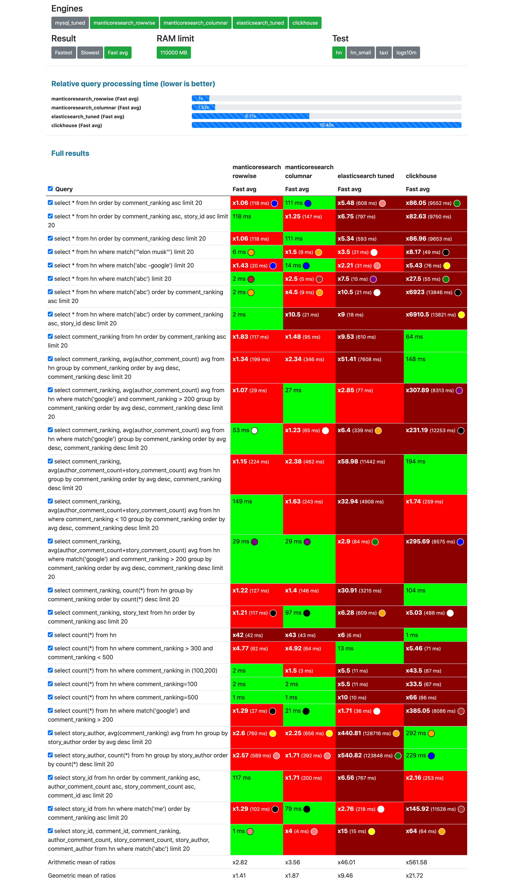
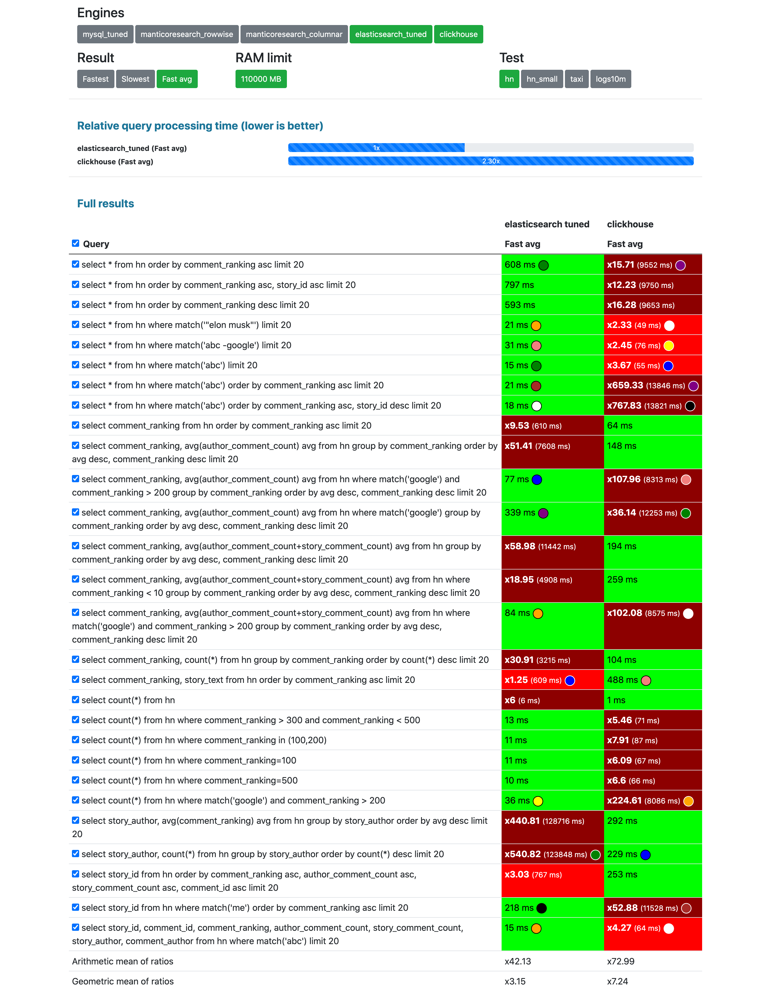
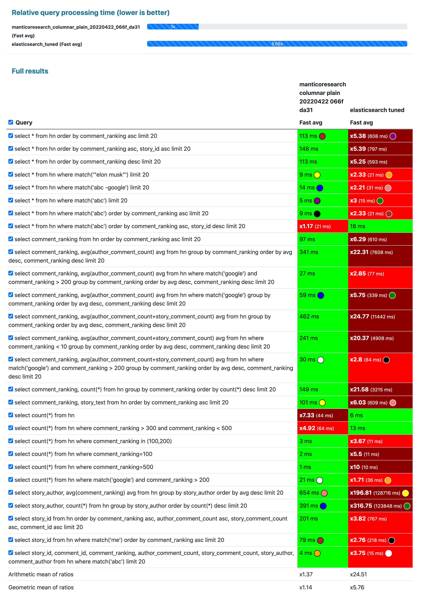
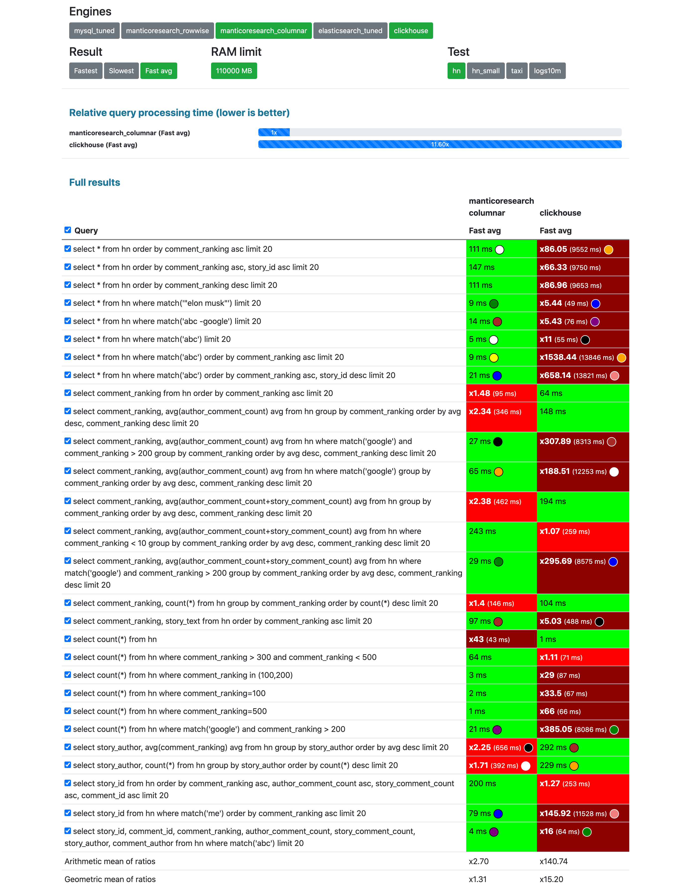
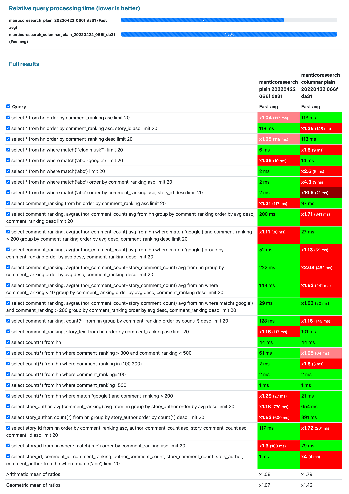

## Intro

In this test we use the data collection of 1.1M [Hacker News](https://news.ycombinator.com/) curated comments with numeric fields from https://zenodo.org/record/45901 **multiplied by 100**. 110 million documents can be considered a medium size data set in the modern world. You you can meet similar size datasets on big blogs and news sites, big online stores, classifieds and so on. It's typical for such applications to have:
* not very long textual data in one or multiple fields
* and a number of attributes

<!--more-->

## Data collection

The source of the data collection is https://zenodo.org/record/45901.

The record structure is:

```json
"properties": {
   "story_id": {"type": "integer"},
   "story_text": {"type": "text"},
   "story_author": {"type": "text", "fields": {"raw": {"type":"keyword"}}},
   "comment_id": {"type": "integer"},
   "comment_text": {"type": "text"},
   "comment_author": {"type": "text", "fields": {"raw": {"type":"keyword"}}},
   "comment_ranking": {"type": "integer"},
   "author_comment_count": {"type": "integer"},
   "story_comment_count": {"type": "integer"}
}
```

## Databases

So far we have made this test available for 3 databases:
* [Clickhouse](https://github.com/ClickHouse/ClickHouse) - a powerful OLAP database,
* [Elasticsearch](https://github.com/elastic/elasticsearch) - general purpose "search and analytics engine",
* [Manticore Search](https://github.com/manticoresoftware/manticoresearch/) - "database for search", Elasticsearch alternative.

{}

* Clickhouse: [no tuning](https://github.com/db-benchmarks/db-benchmarks/blob/main/tests/hn/ch/init), just `CREATE TABLE ... ENGINE = MergeTree() ORDER BY id` and standard [clickhouse-server](https://github.com/db-benchmarks/db-benchmarks/blob/main/docker-compose.yml) docker image.
* Elasticsearch: as we saw in [another test](/test-logs10m/#elasticsearch-with-no-tuning-vs-tuned) sharding can help Elasticsearch signficantly, so given 100+ M documents is not the smallest dataset we decided it would be more fair to:
  - let Elasticsearch make [32 shards](https://github.com/db-benchmarks/db-benchmarks/tree/main/tests/hn/es/logstash_tuned): (`"number_of_shards": 32`), otherwise it couldn't utilize the CPU which has 32 cores on the server, since as [said](https://www.elastic.co/guide/en/elasticsearch/reference/current/size-your-shards.html#single-thread-per-shard) in Elasticsearch official guide "Each shard runs the search on a single CPU thread".
  - we also tuned it by setting `bootstrap.memory_lock=true` since as said on https://www.elastic.co/guide/en/elasticsearch/reference/current/docker.html#_disable_swapping it needs to be done for performance.
  - the docker image is [standard](https://github.com/db-benchmarks/db-benchmarks/blob/main/docker-compose.yml)
* Manticore Search is also used in a form of [their official docker image + the columnar library they provide](https://github.com/db-benchmarks/db-benchmarks/blob/main/docker-compose.yml). The following updates have been [made](https://github.com/db-benchmarks/db-benchmarks/blob/main/tests/hn/manticore/generate_manticore_config.php) to their defaults:
  - `min_infix_len = 2` since in Elasticsearch by default you can do infix full-text search and it would be not fair to let Manticore run in lighter mode (w/o infixes). Unfortunately it's not possible in Clickhouse at all, so it's given the handicap.
  - `secondary_indexes = 1` which enables secondary indexes while filtering (when loading data that's built anyway). Since Elasticsearch uses secondary indexes by default and it's fairly easy to enable the same in Manticore it makes sense to do it. Unfortunately in Clickhouse user would have to make quite an effort to do the same, hence it's not done, since it would then be considered a heavy tuning which would then require further tuning of the other databases which would make things too complicated and unfair.
  - we tested Manticore in two modes:
    - row-wise storage which is a default one, therefore is worth testing
    - columnar storage: the data collection is of medium size, so provided Elasticsearch and Clickhouse internally use column-oriented structures it seems fair to compare them with Manticore's columnar storage too.

{}

## Queries

The query set consists of both full-text and analytical (filtering, sorting, grouping, aggregating) queries:

{}

## Results

You can find all the results on the [results page](/) by selecting "Test: hn". {}

**Unlike other less transparent and less objective benchmarks we are not making any conclusions, we are just leaving screenshots of the results here:**

### 4 competitors at once



### Clickhouse vs Elasticsearch



### Manticore Search (columnar storage) vs Elasticsearch



### Manticore Search (columnar storage) vs Clickhouse



### Manticore Search row-wise storage vs columnar storage



### What about MySQL?

As you can see on the screenshots MySQL has been also tested, but we don't compare it with the others here since it was [heavily tuned](https://github.com/db-benchmarks/db-benchmarks/blob/main/tests/hn/mysql/init) - keys were added based on the queries.

## Disclaimer

{}
