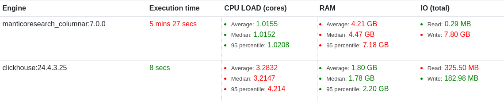
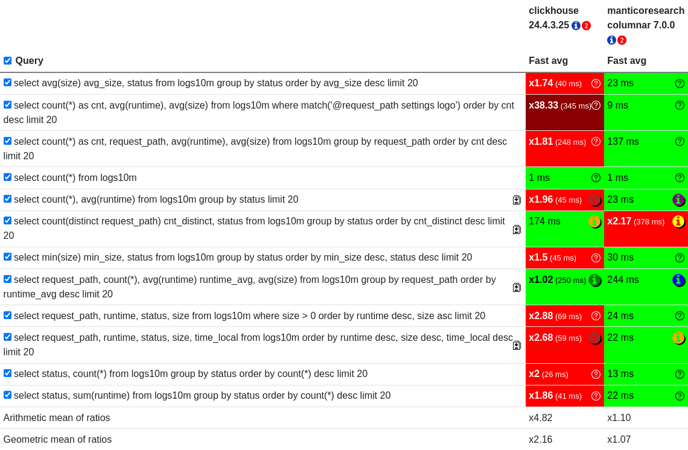

## Text Searching Databases

In the realm of data management, full-text search databases provide specialized solutions for efficient text querying and indexing. Unlike traditional relational databases that may struggle with complex text-based searches, these systems are designed to handle unstructured text data with ease. They excel at indexing large volumes of text and enabling rapid retrieval of relevant information. Applications for these databases are wide-ranging, including search engines, document management systems, e-commerce platforms, and log analysis tools. The key functionalities they offer encompass a variety of search types, each tailored to specific needs.

*   **Full-text search** allows for searching across all indexed words, useful for broad keyword searches.
*   **Lexical search** focuses on exact matches, valuable for precise lookups.
*   **Fuzzy search** enables finding results even with minor spelling errors or variations in the search terms.
*   **Semantic search** attempts to understand the meaning and context of the search query, providing more relevant results based on conceptual similarity.
*   **Vector search** leverages vector embeddings to find similar documents based on semantic meaning.

These capabilities allow users to quickly sift through vast amounts of text data and extract the information they need. For instance, in log analysis, full-text search databases are instrumental in parsing and analyzing server logs, identifying issues, and monitoring system performance. In e-commerce, these databases power product search, allowing customers to find relevant items based on keywords, descriptions, and other textual attributes. Full-text search databases also offer features such as grouping, sorting, and filtering, making them powerful tools for data exploration and analysis. They can also provide capabilities such as geo-search, further enhancing their versatility.

## Benchmarking Databases

When evaluating the performance of full-text search databases, a common approach is to benchmark their capabilities, focusing on two critical aspects: upload performance and query performance. Upload performance measures the speed at which data can be ingested into the database, which is crucial for applications with large datasets or real-time data ingestion requirements. Query performance assesses the speed at which the database can execute search queries and return results, which directly impacts user experience and application responsiveness.

The goal of this benchmark is to compare the performance of two popular full-text search databases: ClickHouse and Manticore Search. We will evaluate their performance on a real-world dataset derived from nginx web server access logs.

## The Databases

*   **ClickHouse 24.4.3.25:** ClickHouse is a column-oriented database management system (DBMS) known for its high performance and scalability, particularly for analytical workloads. It excels at handling large datasets and complex queries, making it suitable for applications like web analytics, ad tracking, and IoT data processing. ClickHouse’s design prioritizes fast data ingestion and query execution through techniques such as data compression, vectorized query execution, and optimized storage formats.
*   **Manticore Search Columnar 7.0.0:** Manticore Search is a full-text search engine and database built on the principles of Sphinx. It provides powerful search capabilities, including full-text search, fuzzy search, and geospatial search. Manticore Search is designed to be highly scalable and efficient, making it suitable for applications such as e-commerce search, document search, and knowledge base management. The columnar variant of Manticore Search further optimizes data storage and query execution for enhanced performance.

## The Experiment

This benchmark compares the performance of ClickHouse 24.4.3.25 and Manticore Search Columnar 7.0.0 using a dataset derived from 10 million nginx logs. The dataset originates from the web server access logs available at [https://www.kaggle.com/datasets/eliasdabbas/web-server-access-logs](https://www.kaggle.com/datasets/eliasdabbas/web-server-access-logs). These logs contain information about website visitors, their actions, and other operational data, which is typical of real-world full-text search use cases. The dataset's characteristics directly impact the types of queries that can be performed and the relevance of the results. For instance, analyzing `request_path` and `runtime` can help identify slow-loading pages or frequently accessed content.

The test environment consists of an AMD Ryzen 9 5950X 16-Core Processor with 32 threads and 128 GB RAM. Both database engines were configured with a RAM limit of 110000 MB. All tests were conducted on a single environment, eliminating potential network or other environmental variables. The experiment does not use batch processing; instead, the same query is executed multiple times to measure response time accurately. The queries were designed to evaluate different aspects of query performance, including filtering, aggregation, and full-text matching. Queries such as those involving `avg(size)` and `status` are relevant for understanding traffic patterns and website performance. The use of the `match()` function tests the engine’s full-text capabilities, crucial for search engine applications.

## Test Results

### Upload Performance

The upload performance was a key metric in evaluating the efficiency of data ingestion for both databases. The goal was to measure the time it took to load the 10 million nginx logs into each database.

The data ingestion time for ClickHouse was 8 seconds, demonstrating its efficiency in handling large datasets. In contrast, Manticore Search took 5 minutes and 27 seconds to complete the data ingestion. The significant difference in upload times highlights ClickHouse's superior performance in ingesting data. This is critical for use cases where real-time or near-real-time data ingestion is required, such as monitoring dashboards or alerting systems.

### Query Performance

Query performance was assessed by measuring the execution time of several representative queries. These queries cover a range of operations common in full-text search scenarios, including aggregation, filtering, and full-text matching. The ability to quickly execute these queries directly impacts the responsiveness of applications that use the databases.

The following table presents the average execution times for each query across the two databases.

| Query | clickhouse 24.4.3.25 | manticoresearch columnar 7.0.0 |
|---|---|---|
| select avg(size) avg_size, status from logs10m group by status order by avg_size desc limit 20 | 23 ms | 40 ms |
| select count(*) as cnt, avg(runtime), avg(size) from logs10m where match('@request_path settings logo') order by cnt desc limit 20 | 9 ms | 345 ms |
| select count(*) as cnt, request_path, avg(runtime), avg(size) from logs10m group by request_path order by cnt desc limit 20 | 137 ms | 248 ms |
| select count(*) from logs10m | 1 ms | 1 ms |
| select status, count(*) from logs10m group by status order by count(*) desc limit 20 | 23 ms | 26 ms |
| select status, sum(runtime) from logs10m group by status order by count(*) desc limit 20 | 22 ms | 41 ms |
| select request_path, count(*), avg(runtime) runtime_avg, avg(size) from logs10m group by request_path order by runtime_avg desc limit 20 | 244 ms | 250 ms |
| select request_path, runtime, status, size from logs10m where size > 0 order by runtime desc, size asc limit 20 | 24 ms | 69 ms |
| select request_path, runtime, status, size, time_local from logs10m order by runtime desc, size desc, time_local desc limit 20 | 22 ms | 59 ms |

Key observations from the query performance benchmark:

*   **Aggregation and Grouping:** Queries involving aggregation (e.g., `avg(size)`, `count(*)`) and grouping (e.g., `group by status`, `group by request_path`) showed that ClickHouse generally outperformed Manticore Search. ClickHouse completed these queries faster. The speed of these queries is crucial for creating performance dashboards and understanding trends in website traffic and resource usage.
*   **Full-Text Matching:** The query incorporating the `match()` function, used for full-text search, demonstrated a significant performance difference. ClickHouse executed this query in significantly less time than Manticore Search, highlighting its efficiency in full-text search operations. This is directly relevant for implementing search functionalities within a web server log analysis tool.
*   **Filtering and Sorting:** Queries combining filtering (e.g., `where size > 0`) and sorting (e.g., `order by runtime desc`) also revealed ClickHouse's superior speed. These types of queries are essential for identifying slow-loading pages or specific issues within the logs.

Notably, the query that used full-text matching showed a dramatic difference in performance, with Manticore Search taking significantly longer to execute. Some queries such as the one with full text matching, are important to users and should be kept in mind when deciding which database to choose.

## Conclusion

In summary, this benchmark test provided valuable insights into the performance characteristics of ClickHouse 24.4.3.25 and Manticore Search Columnar 7.0.0 when used with nginx log data. ClickHouse demonstrated a significant advantage in data ingestion speed, as well as consistently superior query performance across various query types, including aggregation, filtering, and full-text matching. The results indicate that ClickHouse is particularly well-suited for scenarios where rapid data ingestion and efficient query execution are essential, making it an excellent choice for log analysis, web analytics, and similar use cases. While Manticore Search still provides a capable search solution, the benchmarks suggest that it may not be as performant as ClickHouse, particularly for complex queries and large datasets. This benchmark underscores the importance of selecting the right database technology based on specific workload requirements and performance expectations.