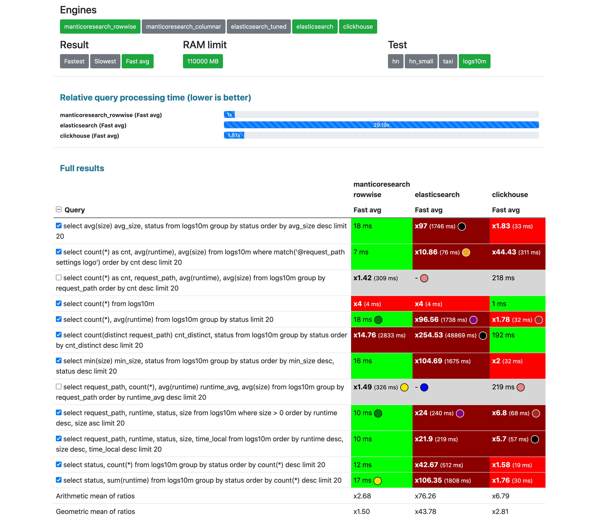
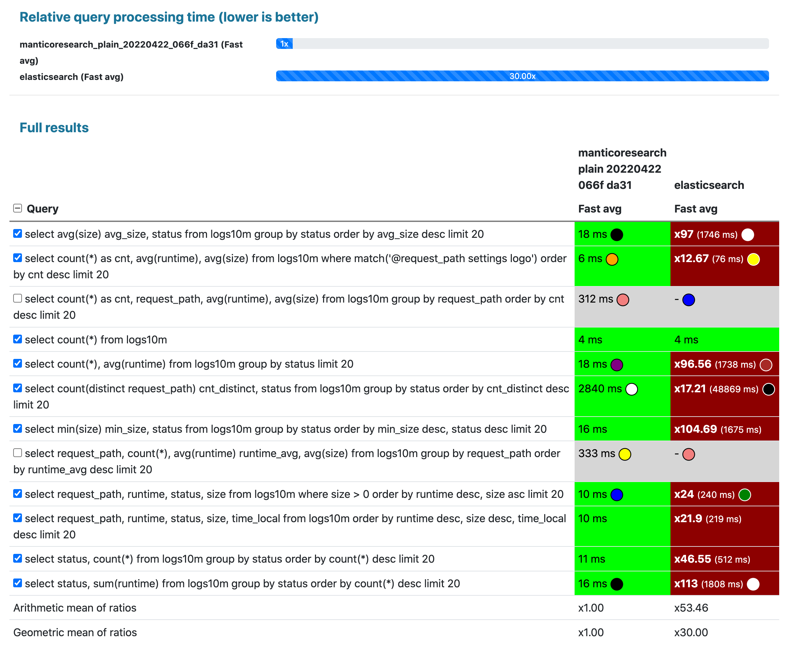
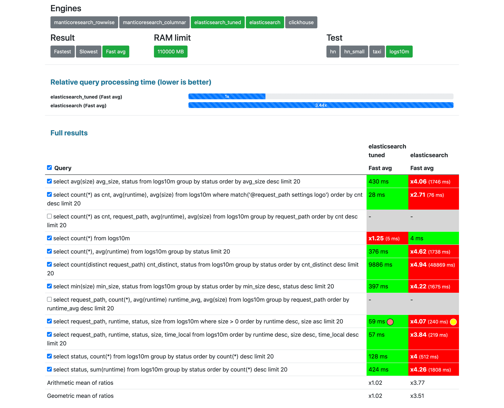
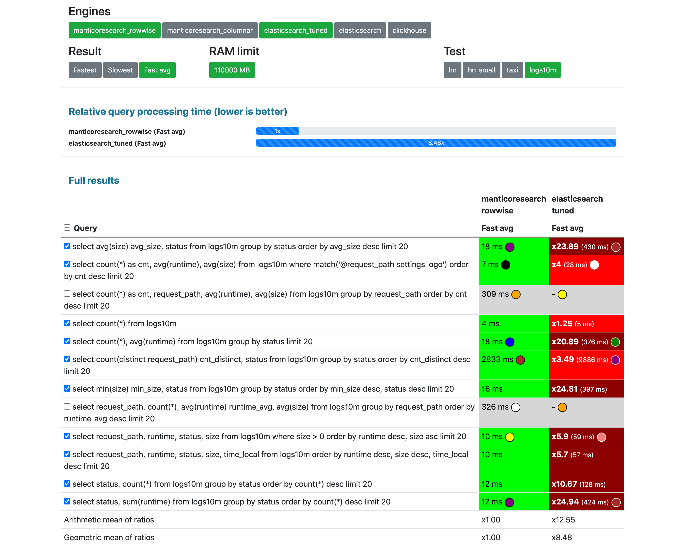
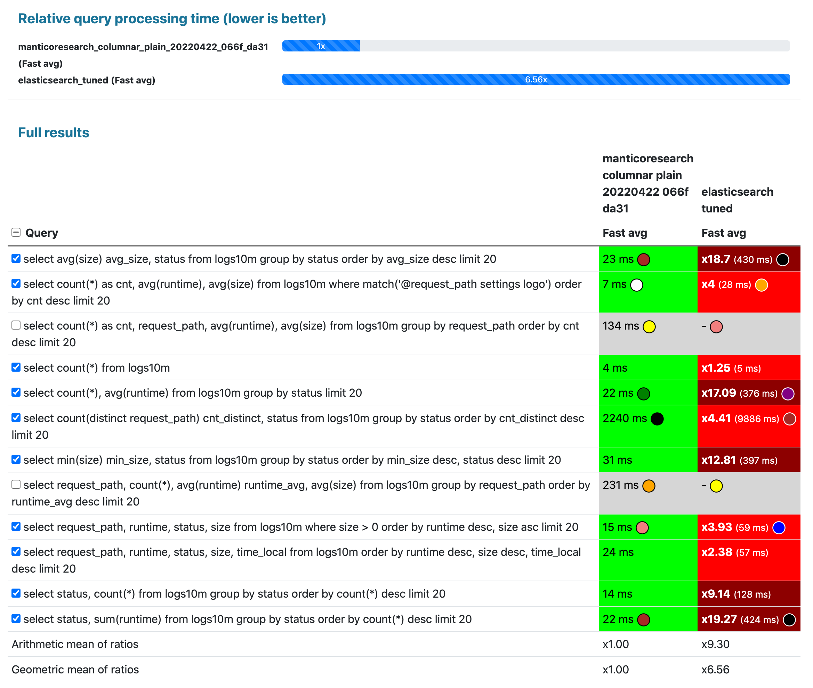
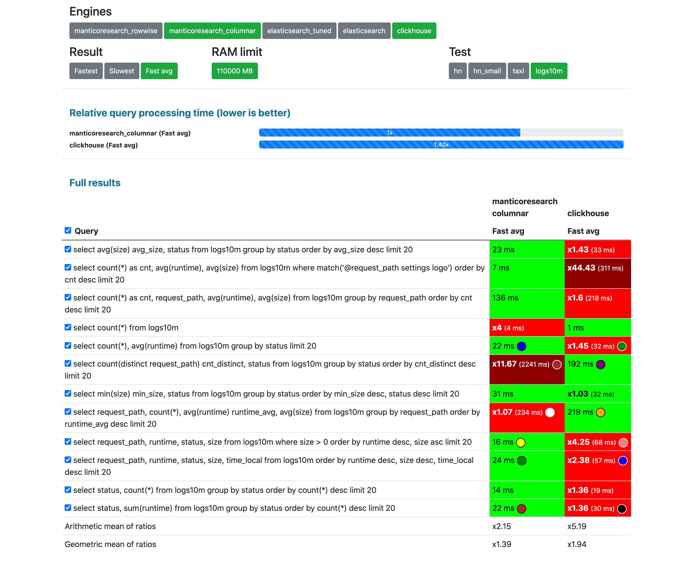
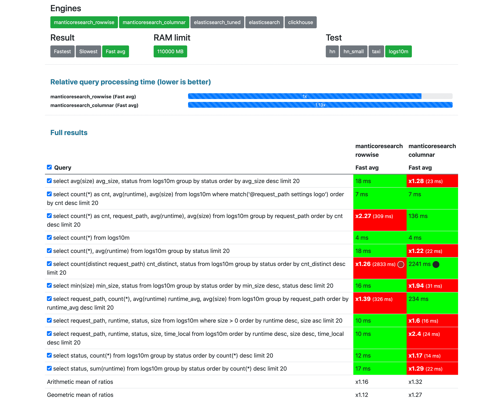

## Intro

In this article we'll observe another test added to / - 10+ million standard HTTP logs collected by Nginx on ecommerce website zanbil.ir.

<!--more-->

## Data collection

We found the data collection on https://www.kaggle.com/datasets/eliasdabbas/web-server-access-logs and found it very interesting to make a test with since the dataset represents a very standard nginx http access log. Here's an example:

```
54.36.149.41 - - [22/Jan/2019:03:56:14 +0330] "GET /filter/27|13%20%D9%85%DA%AF%D8%A7%D9%BE%DB%8C%DA%A9%D8%B3%D9%84,27|%DA%A9%D9%85%D8%AA%D8%B1%20%D8%A7%D8%B2%205%20%D9%85%DA%AF%D8%A7%D9%BE%DB%8C%DA%A9%D8%B3%D9%84,p53 HTTP/1.1" 200 30577 "-" "Mozilla/5.0 (compatible; AhrefsBot/6.1; +http://ahrefs.com/robot/)" "-"
31.56.96.51 - - [22/Jan/2019:03:56:16 +0330] "GET /image/60844/productModel/200x200 HTTP/1.1" 200 5667 "https://www.zanbil.ir/m/filter/b113" "Mozilla/5.0 (Linux; Android 6.0; ALE-L21 Build/HuaweiALE-L21) AppleWebKit/537.36 (KHTML, like Gecko) Chrome/66.0.3359.158 Mobile Safari/537.36" "-"
31.56.96.51 - - [22/Jan/2019:03:56:16 +0330] "GET /image/61474/productModel/200x200 HTTP/1.1" 200 5379 "https://www.zanbil.ir/m/filter/b113" "Mozilla/5.0 (Linux; Android 6.0; ALE-L21 Build/HuaweiALE-L21) AppleWebKit/537.36 (KHTML, like Gecko) Chrome/66.0.3359.158 Mobile Safari/537.36" "-"
40.77.167.129 - - [22/Jan/2019:03:56:17 +0330] "GET /image/14925/productModel/100x100 HTTP/1.1" 200 1696 "-" "Mozilla/5.0 (compatible; bingbot/2.0; +http://www.bing.com/bingbot.htm)" "-"
91.99.72.15 - - [22/Jan/2019:03:56:17 +0330] "GET /product/31893/62100/%D8%B3%D8%B4%D9%88%D8%A7%D8%B1-%D8%AE%D8%A7%D9%86%DA%AF%DB%8C-%D9%BE%D8%B1%D9%86%D8%B3%D9%84%DB%8C-%D9%85%D8%AF%D9%84-PR257AT HTTP/1.1" 200 41483 "-" "Mozilla/5.0 (Windows NT 6.2; Win64; x64; rv:16.0)Gecko/16.0 Firefox/16.0" "-"
40.77.167.129 - - [22/Jan/2019:03:56:17 +0330] "GET /image/23488/productModel/150x150 HTTP/1.1" 200 2654 "-" "Mozilla/5.0 (compatible; bingbot/2.0; +http://www.bing.com/bingbot.htm)" "-"
40.77.167.129 - - [22/Jan/2019:03:56:18 +0330] "GET /image/45437/productModel/150x150 HTTP/1.1" 200 3688 "-" "Mozilla/5.0 (compatible; bingbot/2.0; +http://www.bing.com/bingbot.htm)" "-"
40.77.167.129 - - [22/Jan/2019:03:56:18 +0330] "GET /image/576/article/100x100 HTTP/1.1" 200 14776 "-" "Mozilla/5.0 (compatible; bingbot/2.0; +http://www.bing.com/bingbot.htm)" "-"
66.249.66.194 - - [22/Jan/2019:03:56:18 +0330] "GET /filter/b41,b665,c150%7C%D8%A8%D8%AE%D8%A7%D8%B1%D9%BE%D8%B2,p56 HTTP/1.1" 200 34277 "-" "Mozilla/5.0 (compatible; Googlebot/2.1; +http://www.google.com/bot.html)" "-"
40.77.167.129 - - [22/Jan/2019:03:56:18 +0330] "GET /image/57710/productModel/100x100 HTTP/1.1" 200 1695 "-" "Mozilla/5.0 (compatible; bingbot/2.0; +http://www.bing.com/bingbot.htm)" "-"
207.46.13.136 - - [22/Jan/2019:03:56:18 +0330] "GET /product/10214 HTTP/1.1" 200 39677 "-" "Mozilla/5.0 (compatible; bingbot/2.0; +http://www.bing.com/bingbot.htm)" "-"
40.77.167.129 - - [22/Jan/2019:03:56:19 +0330] "GET /image/578/article/100x100 HTTP/1.1" 200 9831 "-" "Mozilla/5.0 (compatible; bingbot/2.0; +http://www.bing.com/bingbot.htm)" "-"
```

Probably most of web sites in the Internet have a similar log. Many website admins and devops want to be able to process logs like this to do filtering and analytics.

The data collection constitutes 1.7B taxi and for-hire vehicle (Uber, Lyft, etc.) trips originating in New York City since 2009. Most of the [raw data](https://www1.nyc.gov/site/tlc/about/tlc-trip-record-data.page) comes from the NYC Taxi & Limousine Commission.

The data collection record includes a lot of different attributes of a taxi ride:
* pickup date and time
* coordinates of pickup and dropoff
* pickup and dropoff location names
* fee and tip amount
* wind speed, snow depth
* and many other fields

It can be used mostly for testing analytical queries, but it also includes a couple of full-text fields that can be used to test free text capabilities of databases.

After parsing by the [framework](https://github.com/db-benchmarks/db-benchmarks/) there are 11 fields in the log:
* 7 string fields
* 4 integer fields

The whole list of fields and their data types is:

```json
"properties": {
  "remote_addr": {"type": "text"},
  "remote_user": {"type": "text"},
  "runtime": {"type": "long"},
  "time_local": {"type": "long"},
  "request_type": {"type": "text"},
  "request_path": {
    "type": "text",
    "fields": {
      "raw": {
        "type": "keyword"
      }
    }
  },
  "request_protocol": {"type": "text"},
  "status": {"type": "long"},
  "size": {"type": "long"},
  "referer": {"type": "text"},
  "usearagent": {"type": "text"}
}
```

We preliminarily [convert](https://github.com/db-benchmarks/db-benchmarks/tree/main/tests/logs10m/prepare_csv) the raw log to CSV so it's easier to load to different databases and search engines.

## Databases

So far we have made this test available for 3 databases:
* [Clickhouse](https://github.com/ClickHouse/ClickHouse) - a powerful OLAP database,
* [Elasticsearch](https://github.com/elastic/elasticsearch) - general purpose "search and analytics engine",
* [Manticore Search](https://github.com/manticoresoftware/manticoresearch/) - "database for search", Elasticsearch alternative.

We've tried to make as little changes to database default settings as possible to not give either of them an unfair advantage:

* Clickhouse: [no tuning](https://github.com/db-benchmarks/db-benchmarks/blob/main/tests/logs10m/ch/init), just `CREATE TABLE ... ENGINE = MergeTree() ORDER BY id` and standard [clickhouse-server](https://github.com/db-benchmarks/db-benchmarks/blob/main/docker-compose.yml) docker image.
* Elasticsearch: we test in 2 modes:
  - with [no tuning](https://github.com/db-benchmarks/db-benchmarks/blob/main/tests/logs10m/es/logstash/template.json) at all which is probably what most users do
  - with number of [shards equal to the number of CPU cores](https://github.com/db-benchmarks/db-benchmarks/blob/main/tests/logs10m/es/logstash_tuned/template.json) on the server, so Elasticsearch can utilize the CPUs more efficiently for lower response time, since as [said](https://www.elastic.co/guide/en/elasticsearch/reference/current/size-your-shards.html#single-thread-per-shard) in Elasticsearch official guide "Each shard runs the search on a single CPU thread". The dataset size is only 3.5 GB, so it's not clear if it's required or not, but that's why we are testing it.
  - `bootstrap.memory_lock=true` since as said on https://www.elastic.co/guide/en/elasticsearch/reference/current/docker.html#_disable_swapping it needs to be done for performance.
* Manticore Search - [no tuning](https://github.com/db-benchmarks/db-benchmarks/blob/main/tests/logs10m/manticore/generate_manticore_config.php), just a plain index built up from the CSV.
  - we test Manticore's default row-wise storage
  - and columnar storage since Elasticsearch and Clickhouse don't provide row-oriented stores and it may be more fair to compare with Manticore running in this mode.

{}

## Queries

The queries are mostly analytical that do filtering, sorting and grouping, but we've also included one full-text query which searches in the request URL:
{}

## Results

You can find all the results on the [results page](/) by selecting "Test: logs10m". {}

**Unlike other less transparent and less objective benchmarks we are not making any conclusions, we are just leaving screenshots of the results here:**

### 3 competitors with no tuning at once

[avg(80% fastest)](/?cache=fast_avg&engines=manticoresearch_plain_20220422_066f_da31%2Celasticsearch%2Cclickhouse&tests=logs10m&memory=110000&queries=0%2C1%2C3%2C4%2C5%2C6%2C8%2C9%2C10%2C11):



Unfortunately Elasticsearch timed out for 2 queries, hence they were excluded from the final score calculation.

### Elasticsearch with no tuning vs Manticore Search (default row-wise storage)

[avg(80% fastest)](/?cache=fast_avg&engines=manticoresearch_plain_20220422_066f_da31%2Celasticsearch&tests=logs10m&memory=110000&queries=0%2C1%2C3%2C4%2C5%2C6%2C8%2C9%2C10%2C11):



Unfortunately Elasticsearch timed out for 2 queries, hence they were excluded from the final score calculation.

### Elasticsearch with no tuning vs tuned

[avg(80% fastest)](/?cache=fast_avg&engines=elasticsearch_tuned%2Celasticsearch&tests=logs10m&memory=110000&queries=0%2C1%2C3%2C4%2C5%2C6%2C8%2C9%2C10%2C11):



Unfortunately Elasticsearch timed out for 2 queries, hence they were excluded from the final score calculation.

### Elasticsearch tuned vs Manticore Search (default raw-wise storage)

[avg(80% fastest)](/?cache=fast_avg&engines=manticoresearch_plain_20220422_066f_da31%2Celasticsearch_tuned&tests=logs10m&memory=110000&queries=0%2C1%2C3%2C4%2C5%2C6%2C8%2C9%2C10%2C11):



Unfortunately Elasticsearch timed out for 2 queries, hence they were excluded from the final score calculation.

### Elasticsearch tuned vs Manticore Search (columnar storage)

[avg(80% fastest)](/?cache=fast_avg&engines=manticoresearch_columnar_plain_20220422_066f_da31%2Celasticsearch_tuned&tests=logs10m&memory=110000&queries=0%2C1%2C3%2C4%2C5%2C6%2C8%2C9%2C10%2C11):



Unfortunately Elasticsearch timed out for 2 queries, hence they were excluded from the final score calculation.

### Clickhouse vs Manticore Search (columnar storage)

[avg(80% fastest)](/?cache=fast_avg&engines=manticoresearch_columnar_plain_20220422_066f_da31%2Cclickhouse&tests=logs10m&memory=110000&queries=0%2C1%2C2%2C3%2C4%2C5%2C6%2C7%2C8%2C9%2C10%2C11):



### Manticore Search row-wise vs columnar

[avg(80% fastest)](/?cache=fast_avg&engines=manticoresearch_plain_20220422_066f_da31%2Cmanticoresearch_columnar_plain_20220422_066f_da31&tests=logs10m&memory=110000&queries=0%2C1%2C2%2C3%2C4%2C5%2C6%2C7%2C8%2C9%2C10%2C11):



## Disclaimer

{}
