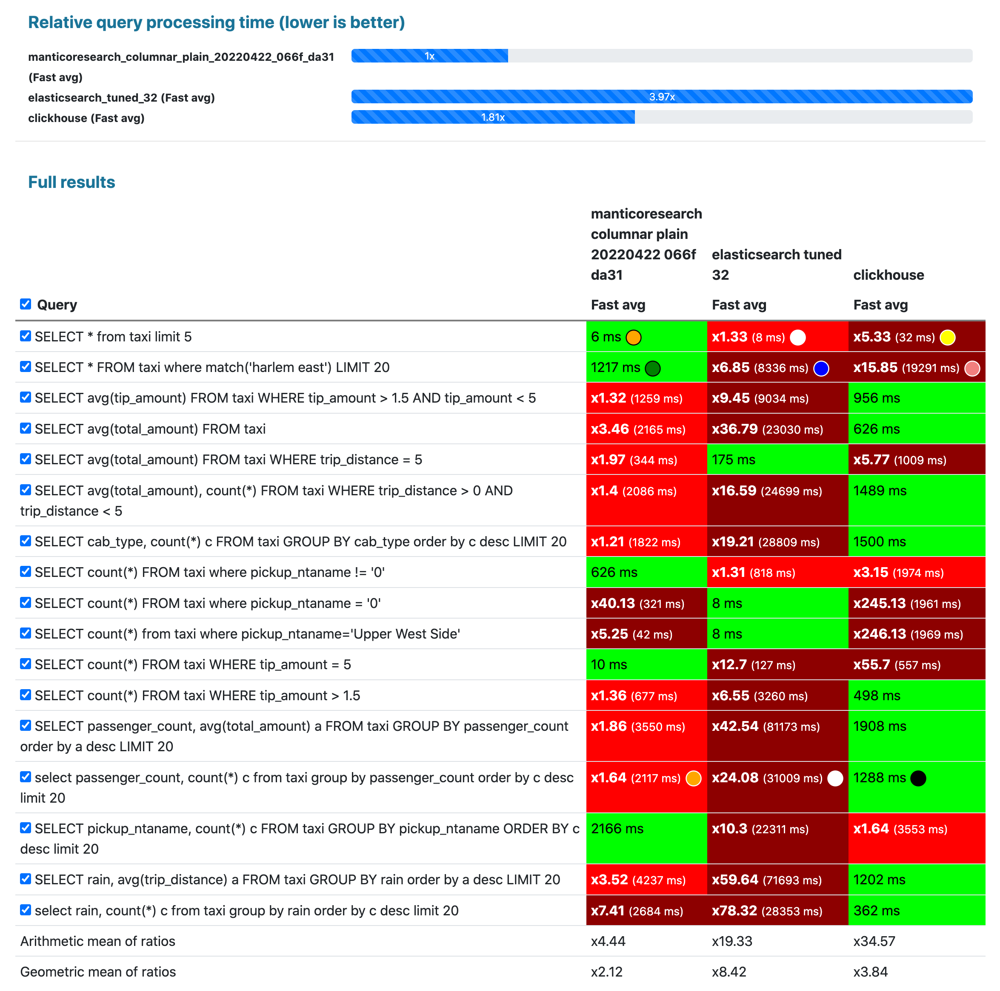
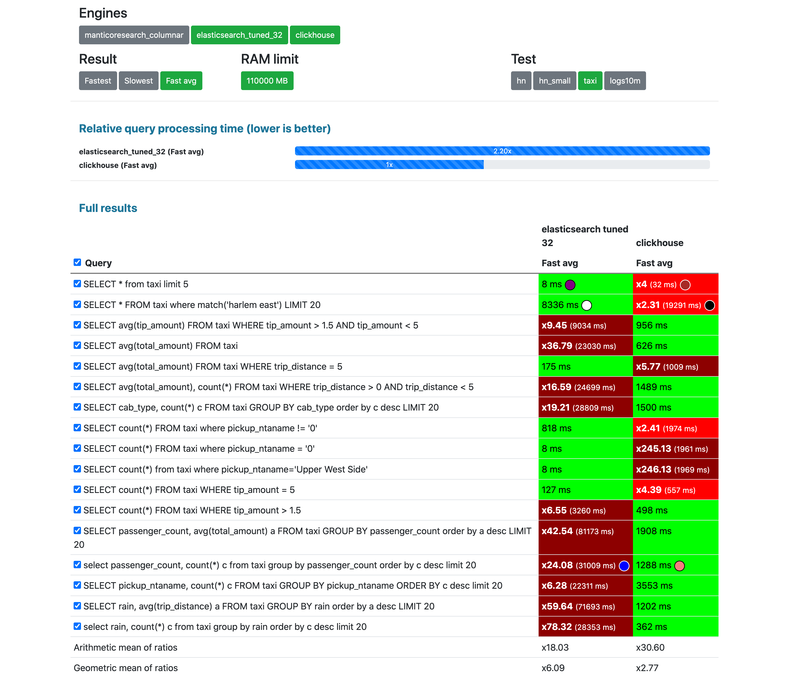
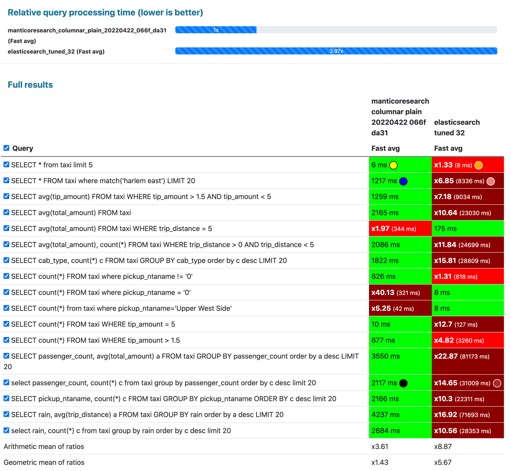
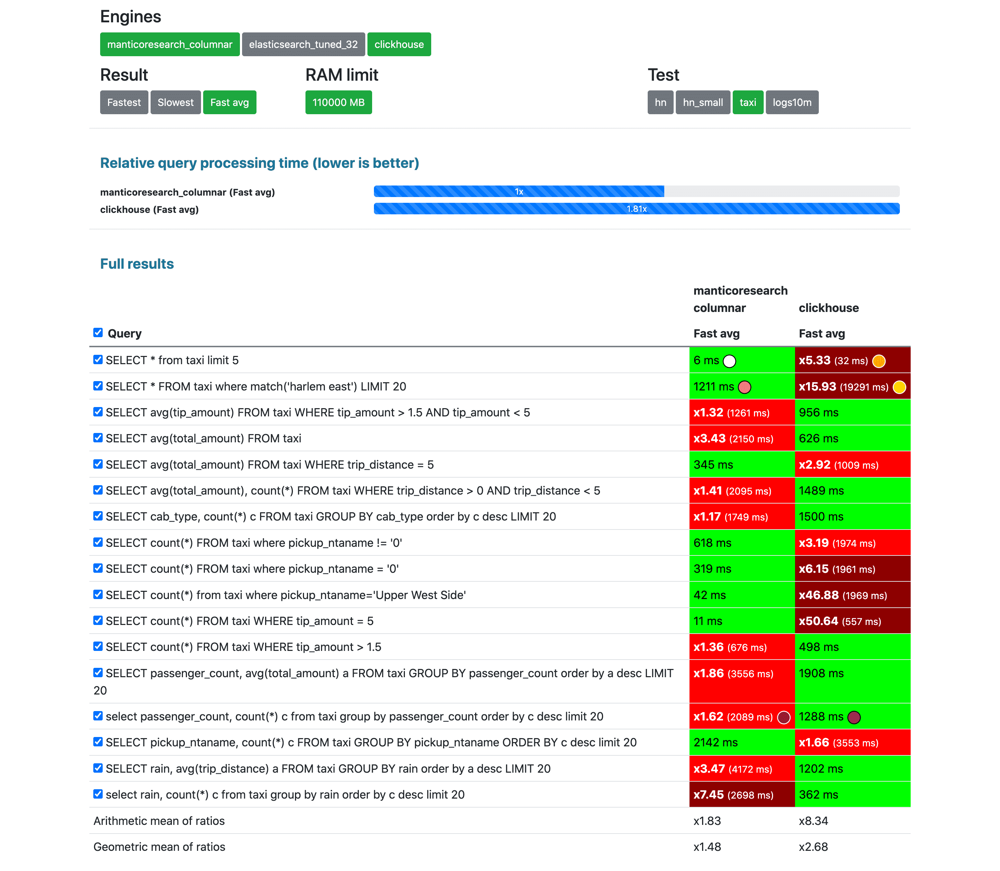

## Intro

NYC taxi rides is probably the most commonly used benchmark in the area of data analytics.

It started with [Todd W. Schneider](https://toddwschneider.com/) deciding to prepare the collection [first in 2015](https://toddwschneider.com/posts/analyzing-1-1-billion-nyc-taxi-and-uber-trips-with-a-vengeance/) to analyze 1.1 billion NYC Taxi and Uber Trips. Then [Mark Litwintschik](https://tech.marksblogg.com/) continued by testing [lots of databases and search engines](https://tech.marksblogg.com/benchmarks.html) using the data collection.

<!--more-->

Now we at https://db-benchmarks.com/:
* have [dockerized preparation of the data collection](https://github.com/db-benchmarks/db-benchmarks/tree/main/tests/taxi/load) to make it easier to use
* made it available as a part of the most transparent and [open source database benchmarks suite](https://github.com/db-benchmarks/db-benchmarks).

## Data collection

The data collection constitutes 1.7B taxi and for-hire vehicle (Uber, Lyft, etc.) trips originating in New York City since 2009. Most of the [raw data](https://www1.nyc.gov/site/tlc/about/tlc-trip-record-data.page) comes from the NYC Taxi & Limousine Commission.

The data collection record includes a lot of different attributes of a taxi ride:
* pickup date and time
* coordinates of pickup and dropoff
* pickup and dropoff location names
* fee and tip amount
* wind speed, snow depth
* and many other fields

It can be used mostly for testing analytical queries, but it also includes a couple of full-text fields that can be used to test free text capabilities of databases.

The whole list of fields and their data types is:

```json
       "properties": {
         "vendor_id": {"type": "keyword"},
         "pickup_datetime": {"type": "date", "format": "epoch_second"},
         "dropoff_datetime": {"type": "date", "format": "epoch_second"},
         "store_and_fwd_flag": {"type": "keyword"},
         "rate_code_id": {"type": "integer"},
         "pickup_longitude": {"type": "float"},
         "pickup_latitude": {"type": "float"},
         "dropoff_longitude": {"type": "float"},
         "dropoff_latitude": {"type": "float"},
         "passenger_count": {"type": "integer"},
         "trip_distance": {"type": "float"},
         "fare_amount": {"type": "float"},
         "extra": {"type": "float"},
         "mta_tax": {"type": "float"},
         "tip_amount": {"type": "float"},
         "tolls_amount": {"type": "float"},
         "ehail_fee": {"type": "float"},
         "improvement_surcharge": {"type": "float"},
         "total_amount": {"type": "float"},
         "payment_type": {"type": "keyword"},
         "trip_type": {"type": "byte"},
         "pickup": {"type": "keyword"},
         "dropoff": {"type": "keyword"},
         "cab_type": {"type": "keyword"},
         "rain": {"type": "float"},
         "snow_depth": {"type": "float"},
         "snowfall": {"type": "float"},
         "max_temp": {"type": "byte"},
         "min_temp": {"type": "byte"},
         "wind": {"type": "float"},
         "pickup_nyct2010_gid": {"type": "integer"},
         "pickup_ctlabel": {"type": "keyword"},
         "pickup_borocode": {"type": "byte"},
         "pickup_boroname": {"type": "keyword"},
         "pickup_ct2010": {"type": "keyword"},
         "pickup_boroct2010": {"type": "keyword"},
         "pickup_cdeligibil": {"type": "keyword"},
         "pickup_ntacode": {"type": "keyword"},
         "pickup_ntaname": {"type": "text", "fields": {"raw": {"type":"keyword"}}},
         "pickup_puma": {"type": "keyword"},
         "dropoff_nyct2010_gid": {"type": "integer"},
         "dropoff_ctlabel": {"type": "keyword"},
         "dropoff_borocode": {"type": "byte"},
         "dropoff_boroname": {"type": "keyword"},
         "dropoff_ct2010": {"type": "keyword"},
         "dropoff_boroct2010": {"type": "keyword"},
         "dropoff_cdeligibil": {"type": "keyword"},
         "dropoff_ntacode": {"type": "keyword"},
         "dropoff_ntaname": {"type": "text", "fields": {"raw": {"type":"keyword"}}},
         "dropoff_puma": {"type": "keyword"}
       }
```

## Databases

So far we have made this test available for 3 databases:
* [Clickhouse](https://github.com/ClickHouse/ClickHouse) - a powerful OLAP database,
* [Elasticsearch](https://github.com/elastic/elasticsearch) - general purpose "search and analytics engine",
* [Manticore Search](https://github.com/manticoresoftware/manticoresearch/) - "database for search", Elasticsearch alternative.

We've tried to make as little changes to database default settings as possible to not give either of them an unfair advantage:

* Clickhouse: [no tuning](https://github.com/db-benchmarks/db-benchmarks/blob/main/tests/taxi/init), just `CREATE TABLE ... ENGINE = MergeTree() ORDER BY id` and standard [clickhouse-server](https://github.com/db-benchmarks/db-benchmarks/blob/main/docker-compose.yml) docker image.
* Elasticsearch: here to make it fair to compare with the other databases we [had to help Elasticsearch](https://github.com/db-benchmarks/db-benchmarks/blob/main/tests/taxi/es/logstash_tuned/template.json) by:
  - letting it make 32 shards: (`"number_of_shards": 32`), otherwise it couldn't utilize the CPU which has 32 cores on the server, since as [said](https://www.elastic.co/guide/en/elasticsearch/reference/current/size-your-shards.html#single-thread-per-shard) in Elasticsearch official guide "Each shard runs the search on a single CPU thread".
  - `bootstrap.memory_lock=true` since as said on https://www.elastic.co/guide/en/elasticsearch/reference/current/docker.html#_disable_swapping it needs to be done for performance.
  - the docker image is [standard](https://github.com/db-benchmarks/db-benchmarks/blob/main/docker-compose.yml)
* Manticore Search is also used in a form of [their own docker image + the columnar library they provide](https://github.com/db-benchmarks/db-benchmarks/blob/main/docker-compose.yml):
  - as well as with Elasticsearch we [also use](https://github.com/db-benchmarks/db-benchmarks/blob/main/tests/taxi/manticore/generate_manticore_config.php) 32 shards in a form of 32 plain indexes
  - and we use Manticore columnar storage since comparing Manticore's default row-wise storage vs Clickhouse's and Elasticsearch's columnar storages would be not fair on such a large data collection.

{}

## Queries

The queries are mostly analytical queries that do filtering, sorting and grouping. We've also included one full-text query:
{}

## Results

You can find all the results on the [results page](/) by selecting "Test: taxi". {}

**Unlike other less transparent and less objective benchmarks we are not making any conclusions, we are just leaving screenshots of the results here:**

### 3 competitors at once



### Clickhouse vs Elasticsearch



### Manticore Search vs Elasticsearch



### Manticore Search vs Clickhouse



## Disclaimer

{}
